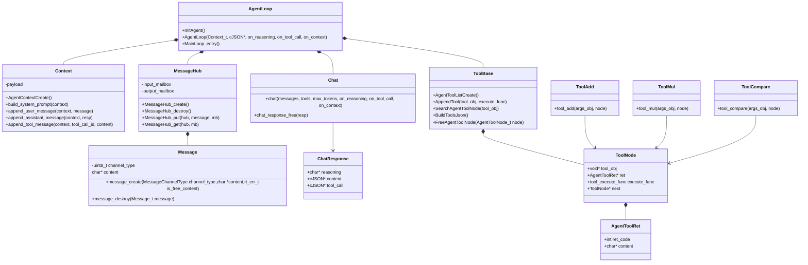

# Agent Framework

An intelligent agent framework built on RT-Thread that enables interaction with Large Language Models (LLMs) with tool capabilities.

## Overview

This framework allows the creation of intelligent agents that can interact with LLMs through API calls, process tool requests, and maintain conversation context. It supports tool execution, conversation state management, and message passing between components.

### demo

## Architecture

The framework consists of several core components that work together to enable agent functionality:

### Core Components

- **AgentLoop**: Main agent execution loop that orchestrates the interaction with LLM and tools
- **Chat**: Handles communication with the LLM API and manages streaming responses
- **MessageHub**: Manages message passing between different components using mailboxes
- **Context**: Maintains the conversation history and context for LLM interactions
- **Tool System**: Provides tool registration, execution, and management capabilities

### UML Class Diagram

## Key Features

### 1. Agent Loop System
- Main execution loop that orchestrates LLM interaction with tools
- Handles tool execution loops with proper context management
- Manages conversation state throughout agent interactions

### 2. Multi-Channel Messaging
- MessageHub handles communication between components
- Supports different message channels (CLI, WebNET, Assistant)
- Uses RT-Thread mailboxes for efficient messaging

### 3. Context Management
- Maintains conversation history with proper role assignment
- Supports system, user, assistant, and tool roles
- Manages context for LLM API calls

### 4. Tool System
- Dynamic tool registration and discovery
- Tool execution with parameter parsing
- Support for multiple tool types (add, multiply, compare)

### 5. Streaming API Support
- Handles streaming responses from LLMs
- Processes reasoning and content separately
- Manages tool call responses through streaming

## Component Details

### AgentLoop.c
Main agent loop that:
- Initializes components (MessageHub, Context, Tools)
- Orchestrates the chat interaction with LLM
- Processes and executes tool calls
- Manages the conversation loop

### Chat.c
Handles communication with LLM API:
- Generates requests with messages and tools
- Processes streaming responses
- Handles reasoning and content extraction
- Manages tool call parsing

### MessageHub.c
Manages message passing between components:
- Creates input/output mailboxes
- Provides messaging interface for components
- Handles message creation and destruction

### Context.c
Maintains conversation context:
- Manages conversation history
- Builds and appends different message types
- Supports different role-based messages

### Tool System
- `tool_base.c`: Base tool management functionality
- `tool_func.c`: Tool registration and initialization
- `tool_add.c`, `tool_mul.c`, `tool_compare.c`: Concrete tool implementations

## Usage

1. Initialize the agent system with `MainLoop_entry()`
2. Send messages through the MessageHub to start agent interactions
3. The agent will process messages through the LLM and execute tools as needed
4. Results are posted back through the MessageHub

## Configuration

The framework can be configured through RT-Thread package settings:
- API key, URL, and model name
- Buffer sizes for responses and streaming
- Maximum tool execution loop count

## Dependencies

- RT-Thread RTOS
- cJSON library for JSON processing
- webclient for HTTP communication
- ulog for logging

## License

This project is licensed under the MIT License.