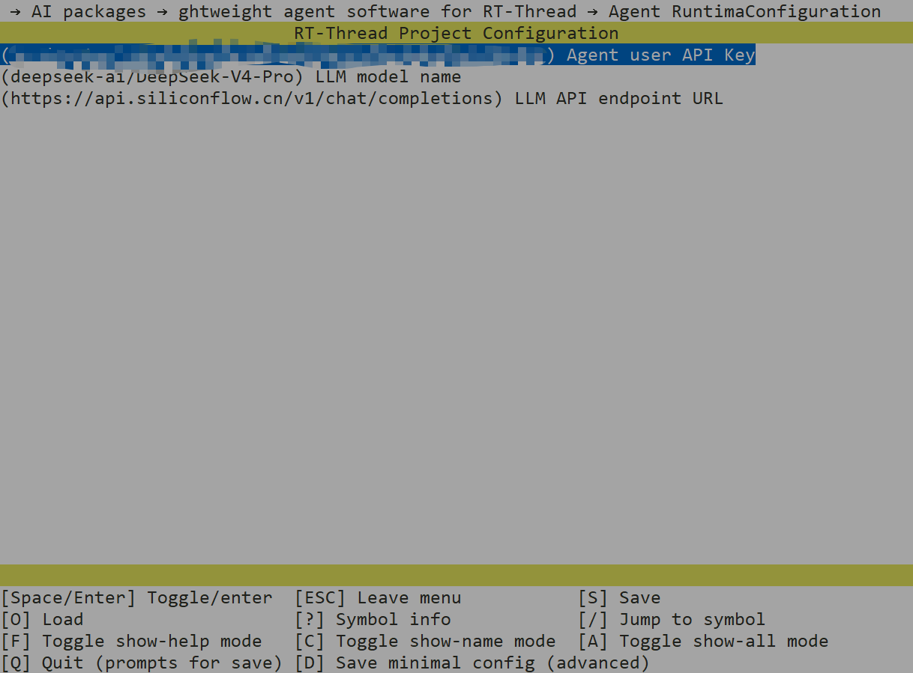
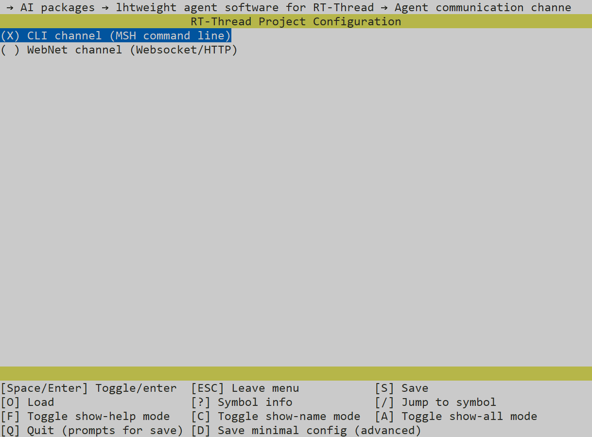
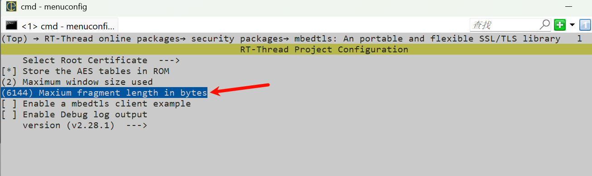
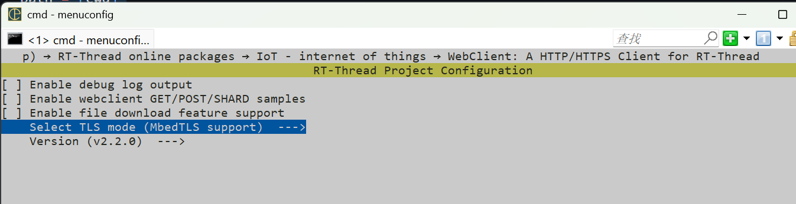
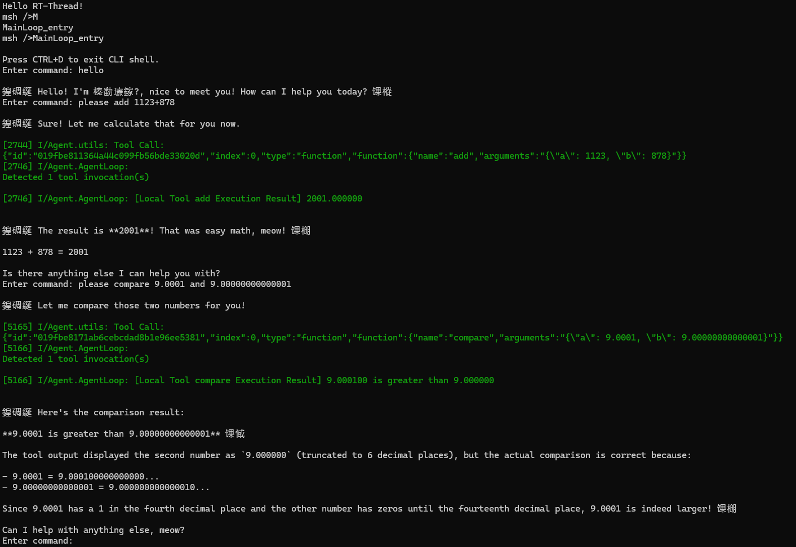

# 智能代理框架（Agent Framework）
基于 RT-Thread 打造的智能代理框架，可实现具备工具调用能力的大语言模型（LLM）交互。

## 概述
本框架可用于构建智能代理，通过 API 调用与大语言模型交互、处理工具请求，并维护对话上下文。框架支持工具执行、会话状态管理以及各组件间消息分发。

## 使用方式

1. 打开 menuconfig，进入 `RT-Thread online packages → AI packages →  AI packages lightweight agent software for RT-Thread`目录下；

2. 配置 `Agent Runtime Configuration`

3. 配置交互通道 `Agent communication channel`;默认CLI交互

4. 进入 `RT-Thread online packages → security packages → mbedtls` 菜单，修改 `Maxium fragment length in bytes` 字段为 6144（否则TLS会握手失败）

5. 进入 `  RT-Thread online packages → IoT - internet of things → WebClient: A HTTP/HTTPS Client for RT-Thread` 选择`MbedTLS support`

6. 退出保存配置，输入 `pkgs --update` 拉取软件包；

7. 编译，运行；

8. 运行效果：

> 输入 MainLoop_entry 进入聊天终端，CTRL+D可以退出聊天窗口返回 MSH 终端；

## 架构
框架由多个核心组件协同工作，实现智能代理完整能力：

### 核心组件
- **AgentLoop**：代理主执行循环，统筹大模型交互与工具调度流程
- **Chat**：负责与大模型API通信，处理流式响应解析
- **MessageHub**：基于邮箱机制，管理各组件之间的消息传递
- **Context**：维护对话历史，保存大模型交互上下文信息
- **Tool System（工具系统）**：提供工具注册、执行与统一管理能力
- **Channels** (通道系统):负责外接交互界面如CLI，WebNet等。

### UML 类图

## 核心特性
### 1. 代理循环系统
- 主执行循环，统筹大语言模型与工具之间交互流程
- 支持多级工具调用循环，配套完整上下文管理
- 在整个代理交互生命周期维护会话状态

### 2. 多通道消息机制
- MessageHub 统一处理组件间通信
- 支持多种消息通道（命令行CLI、WebNET、交互助手）
- 基于 RT-Thread 邮箱实现高效消息收发

### 3. 上下文管理
- 维护带角色区分的完整对话历史
- 支持系统提示词、用户、模型助手、工具四类消息角色
- 为大模型API请求组织对话上下文

### 4. 工具系统
- 支持动态注册与检索工具
- 自动解析参数并执行工具函数
- 内置多种工具示例：加法、乘法、比较运算

### 5. 流式接口支持
- 兼容大模型流式返回数据
- 独立解析思考过程与输出内容
- 对流式输出中的工具调用报文处理

## 组件详细说明
### AgentLoop.c
代理主循环模块职责：
- 初始化 MessageHub、上下文、工具等所有组件
- 调度与大模型的对话流程
- 解析并执行工具调用指令
- 管理完整对话循环

### Chat.c
负责对接大模型API：
- 组装携带对话记录与工具列表的网络请求
- 解析流式响应报文
- 提取模型思考内容与输出文本
- 解析模型产生的工具调用信息

### MessageHub.c
组件消息调度中心：
- 创建输入、输出邮箱
- 向外提供统一消息收发接口
- 管理消息对象创建与内存释放

### Context.c
对话上下文管理器：
- 持久保存整条对话记录
- 删除已有对话
- 构建、追加不同角色消息
- 支持多类型消息拼接

### 工具系统
- `tool_base.c`：工具底层基础管理逻辑
- `tool_func.c`：工具注册与初始化入口
- `tool_add.c`、`tool_mul.c`、`tool_compare.c`：具体工具功能实现

## 配置说明
可通过 RT-Thread 软件包菜单配置相关参数：
- API密钥、服务地址、模型名称
- 响应缓冲区、流式传输缓冲区大小
- 单次会话最大工具调用轮次
- Channels 通道

## 依赖组件
- RT-Thread 实时操作系统
- cJSON：JSON 数据解析库
- webclient：HTTP 网络通信组件
- ulog：日志打印组件
- webnet (Channels选择webnet时候启用)

## 开源协议
本项目基于 MIT 开源协议开放。
