# 智能代理框架（Agent Framework）
基于 RT-Thread 打造的智能代理框架，可实现具备工具调用能力的大语言模型（LLM）交互。

> 文档入口：[框架文档](./docs/framework.md) ｜ [API 文档](./docs/api.md) ｜ [工具开发指南](./docs/tool_guide.md) ｜ [MQTT 工具说明](./docs/tool_mqtt.md)

## 概述
本框架可用于构建智能代理，通过 API 调用与大语言模型交互、处理工具请求，并维护对话上下文。框架支持工具执行、会话状态管理、多通道交互（CLI / WebNet / Debug），以及"进入对话 → 清理 → 再次进入"的完整生命周期管理（清理后内存回到基线）。

## 使用方式

1. 打开 menuconfig，进入 `RT-Thread online packages → AI packages → AI packages lightweight agent software for RT-Thread` 目录下；

2. 配置 `Agent Runtime Configuration`

3. 配置交互通道 `Agent communication channel`；默认 CLI 交互

4. 进入 `RT-Thread online packages → security packages → mbedtls` 菜单，修改 `Maxium fragment length in bytes` 字段为 6144（否则 TLS 会握手失败）

5. 进入 `RT-Thread online packages → IoT - internet of things → WebClient: A HTTP/HTTPS Client for RT-Thread` 选择 `MbedTLS support`

6. 退出保存配置，输入 `pkgs --update` 拉取软件包；

7. 编译，运行；

8. 运行效果：

> 输入 `main_loop_entry` 进入聊天终端，CTRL+D 退出聊天窗口返回 MSH 终端；
> 退出后执行 `cleanup_agent_entry` 清理全部资源（释放内存），可再次 `main_loop_entry` 重新进入对话。

## 架构
框架由多个核心组件协同工作，实现智能代理完整能力。详细设计见 [框架文档](./docs/framework.md)。

### 核心组件
- **AgentLoop**：代理主执行循环，统筹大模型交互与工具调度流程，负责生命周期管理（init/cleanup）
- **Chat**：负责与大模型 API 通信，流式（SSE）响应解析（思考 / 正文 / 工具调用）
- **MessageHub**：基于 RT-Thread 邮箱机制，管理各组件之间的消息传递（支持可中断的超时接收）
- **Context**：维护对话历史，保存大模型交互上下文信息（支持清空与裁剪）
- **Tool System（工具系统）**：提供工具注册、查找、执行与统一管理能力（支持整体清理与重新注册）
- **Channels（通道系统）**：负责外接交互界面（CLI / WebNet / Debug），通过统一的 `AgentChannelOps` 函数指针接口接入

### UML 类图（mermaid）

```mermaid
classDiagram
    direction TB

    %% ========== 第1层：顶层调度 AgentLoop（唯一入口） ==========
    class AgentLoop {
        +init_agent()
        +agent_loop(ctx, tools, on_reasoning, on_tool_call, on_context)
        +main_loop_entry()
        +cleanup_agent_entry()
        +cleanup_agent()
        -g_channel_ops : AgentChannelOps*
    }

    %% ========== 第2层：核心组件（仅与 AgentLoop 交互） ==========
    class MessageHub {
        -input_mailbox : rt_mailbox_t
        -output_mailbox : rt_mailbox_t
        +message_hub_create() MessageHub_t
        +message_hub_destroy(hub)
        +message_hub_put(hub, message, mb) rt_err_t
        +message_hub_get(hub, mb) Messages_t
        +message_hub_get_timeout(hub, mb, timeout) Messages_t
    }
    class Context {
        -message : cJSON*
        +agent_context_create() Context_t
        +agent_context_destroy(context)
        +build_system_prompt(self)
        +append_user_message(self, messages)
        +append_assistant_message(self, resp)
        +append_tool_message(self, tool_call_id, messages)
        +clear_message(self)
        +trim_context(self, keep_items)
    }
    class Chat {
        +chat(messages, tools, max_tokens, on_reasoning, on_tool_call, on_context) ChatResponse_t
        +chat_response_free(resp)
    }
    class ToolBase {
        +agent_tool_list_create() rt_err_t
        +append_tool(tool_obj, execute_func) rt_err_t
        +build_tools_json() cJSON*
        +get_agent_tools() cJSON*
        +search_agent_tool_node(tool_obj) AgentToolNode_t
        +free_agent_tool_node(node)
        +agent_tool_list_destroy()
    }

    %% ========== 第3层：内部从属对象（仅归属上层组件） ==========
    class Messages {
        -message_ptr : MessageItem_t
        -max_size : int
        -current_size : int
        +messages_create(max_size) Messages_t
        +messages_append(messages, type, content) rt_err_t
        +messages_destroy(messages)
        +messages_get_content_idx(messages, idx) char*
        +messages_get_type_idx(messages, idx) MessageType
    }
    class ChatResponse {
        +char* reasoning
        +char* context
        +cJSON* tool_call
    }
    class AgentToolNode {
        +cJSON* tool_obj
        +AgentToolRet ret
        +execute_func(param, node)
        +AgentToolNode* next
    }
    class AgentToolRet {
        +rt_err_t ret
        +Messages_t messages
    }

    %% ========== 第4层：业务工具实现（仅绑定 ToolNode） ==========
    class ToolAdd {
        +tool_add(args_obj, node)
    }
    class ToolMul {
        +tool_mul(args_obj, node)
    }
    class ToolCompare {
        +tool_compare(args_obj, node)
    }
    class ToolMqtt {
        +tool_mqtt_publish(args_obj, node)
        +tool_mqtt_subscribe(args_obj, node)
        +tool_mqtt_rule(args_obj, node)
        +tool_mqtt_receive(args_obj, node)
        +mqtt_tool_start() rt_err_t
        +mqtt_tool_stop() void
        +mqtt_tool() MSH 命令
    }
    class MqttModules {
        <<module>>
        tool_mqtt.c 引擎核心
        tool_mqtt_client.c 连接与订阅
        tool_mqtt_route.c 接收线程与路由
        tool_mqtt_filter.c 过滤与阈值规则
        tool_mqtt_ops.c 业务操作
        tool_mqtt_tools.c 工具入口
        tool_mqtt_cmd.c MSH 命令
    }

    %% ========== 第5层：交互通道（ops 接口，函数指针统一分发） ==========
    class AgentChannelOps {
        <<interface>>
        +init(hub, ctx) int
        +reset() void
    }
    class CLIChannel {
        +agent_cli_channel(hub, ctx) int
        +agent_cli_stop() void
    }
    class WebNetChannel {
        +webnet_agent_mode(hub, ctx) void
        +agent_webnet_reset() void
    }
    class DebugChannel {
        +agent_debug_channel(hub, ctx) int
        +agent_debug_reset() void
    }

    %% ========== 关联关系 ==========
    %% 顶层调度 聚合 第二层组件
    AgentLoop *-- MessageHub
    AgentLoop *-- Context
    AgentLoop *-- Chat
    AgentLoop *-- ToolBase

    %% 通道 ops：函数指针（聚合，非组合）
    AgentLoop o-- AgentChannelOps : g_channel_ops

    %% 第二层 → 第三层（内部对象）
    MessageHub *-- Messages : 邮箱传递
    Chat --> ChatResponse : 返回
    ToolBase *-- AgentToolNode
    AgentToolNode *-- AgentToolRet

    %% 第四层业务工具绑定 ToolNode
    ToolAdd --> AgentToolNode
    ToolMul --> AgentToolNode
    ToolCompare --> AgentToolNode
    ToolMqtt --> AgentToolNode
    ToolMqtt *-- MqttModules

    %% 第五层通道实现 ops 接口
    CLIChannel ..|> AgentChannelOps
    WebNetChannel ..|> AgentChannelOps
    DebugChannel ..|> AgentChannelOps
```

## 核心特性
### 1. 代理循环系统
- 主执行循环，统筹大语言模型与工具之间交互流程
- 支持多级工具调用循环（最多 10 轮），配套完整上下文管理
- 在整个代理交互生命周期维护会话状态

### 2. 多通道消息机制
- MessageHub 统一处理组件间通信（输入/输出双邮箱）
- 支持多种交互通道（CLI / WebNet / Debug），统一 ops 接口接入
- 基于 RT-Thread 邮箱实现高效消息收发，支持超时接收，清理不卡死

### 3. 上下文管理
- 维护带角色区分的完整对话历史（system / user / assistant / tool）
- 支持系统提示词、清空会话、按条数裁剪上下文
- 为大模型 API 请求组织对话上下文

### 4. 工具系统
- 支持动态注册与检索工具
- 自动解析参数并执行工具函数，结果回填上下文
- 内置多种工具示例：加法、乘法、比较运算（扩展见 [工具开发指南](./docs/tool_guide.md)）
- 内置 MQTT 工具：**发布话题命令**（`mqtt_publish`）+ **订阅话题并只在需要时打扰 agent**（`mqtt_subscribe` / `mqtt_rule` / `mqtt_receive`，见 [MQTT 工具说明](./docs/tool_mqtt.md)）
  - 默认 `filter` 模式：只有**报文像咨询**或**命中阈值规则**（`mqtt_rule`，含边沿触发与冷却）时才交给 agent 做简短总结/告警，例行数据本地过滤，不消耗 LLM 调用

### 5. 流式接口支持
- 兼容大模型流式返回数据（SSE）
- 独立解析思考过程、回答正文与工具调用报文
- 网络超时保护，避免阻塞清理流程

### 6. 生命周期与内存管理
- `main_loop_entry` 进入对话，`cleanup_agent_entry` 清理全部资源
- 支持"进入 → 对话 → 清理 → 再进入"无限循环，清理后堆内存回到基线
- 清理内置堆内存快照日志（`[mem] cleanup done`），便于验证无泄漏

## 组件详细说明
### AgentLoop.c
代理主循环模块职责：
- 初始化 MessageHub、上下文、工具、通道（ops 函数指针统一分发）等所有组件
- 调度与大模型的对话流程（含工具循环）
- 解析并执行工具调用指令，管理完整对话循环
- 生命周期管理：`init_agent` / `cleanup_agent`（释放 hub、context、工具链、通道资源）

### Chat.c
负责对接大模型 API：
- 组装携带对话记录与工具列表的网络请求
- 解析流式（SSE）响应报文
- 提取模型思考内容、回答输出与工具调用信息（按 index 合并分片）

### MessageHub.c
组件消息调度中心：
- 创建输入、输出邮箱，提供统一消息收发接口（含超时接收）
- 管理消息对象创建与内存释放（销毁时排空残留消息，防泄漏）

### Context.c
对话上下文管理器：
- 持久保存整条对话记录，删除已有对话
- 构建、追加不同角色消息，支持上下文裁剪

### 工具系统
- `tool_base.c`：工具底层基础管理逻辑（链表、查找、整体销毁）
- `tool_func.c`：工具注册与初始化入口（`init_tools` / `agent_tools_cleanup`）
- `tool_add.c`、`tool_mul.c`、`tool_compare.c`：具体工具功能实现
- `tools/tool_mqtt/`：MQTT 工具（发布话题命令 / 订阅话题并交给 agent 分析；含接收线程、话题表、poll 缓冲与 `mqtt_tool` 调试命令，见 [MQTT 工具说明](./docs/tool_mqtt.md)）
- `AgentRuntime.h`：agent 运行时访问器（`agent_get_message_hub` / `agent_is_running` / `agent_is_busy`，由 `AgentLoop.c` 实现，供工具层向 agent 注入消息）
- `utils.h` / `utils.c`：公共注入入口 `agent_inject_text()` —— 任何工具/驱动把一段文本作为用户消息交给 agent（`role=user`，等待 LLM 分析/总结/告警），不必自己拼 `MessageHub`；MQTT 路由线程即用它投递订阅消息（原先名为 `mqtt_inject_text()`，已提升为框架公共 API）

### 工具调用排查（常见坑）

| 现象 | 原因 | 处理 |
|---|---|---|
| 模型回答「我准备调用 XX 工具」但没有 `Detected N tool invocation(s)`，也没有工具结果 | 带 `tool_calls` 的 SSE 报文行较长（实测 ~310 字节），若 `PKG_AGENT_STREAM_LINE_BUFSZ` 太小会被整行丢弃 | 该值已设为 1024，并会在超长时打印告警；如自定义工具参数很大可继续调大 |
| 看不到思考过程（界面空白） | 提供方字段名是 `reasoning_content`，框架原只识别 `reasoning` | 两个字段名均已支持（`src/chat.c`） |
| 工具参数（arguments）拼接不完整 | 流式后续分片 `id`/`type`/`name` 为 `null`，需按 `index` 累积 | 已做分片容错与归一化（缺失 `id` 用 `call_<index>` 兜底） |
| 日志里出现 `Chat request failed` / `mbedtls_client_read data error, return -0x4c` / `http status=-76` | `-0x4c` = `MBEDTLS_ERR_NET_RECV_FAILED`：TLS 连接读取响应时被对端或网络重置；请求过于密集（如设备周期性上报逐条触发 LLM）时最易出现 | 已缓解：MQTT 注入侧错峰+合并（1s 间隔、批量 5 条、agent 忙时等待空闲）+ 框架侧失败自动重试 3 次；仍频繁可调大 `PKG_AGENT_TOOL_MQTT_INJECT_MIN_INTERVAL_MS` 或降低上报频率 |
| **模型反复调用同一个工具十几轮、最后不给任何回答（像卡死）** | ① 工具结果里的长度参数没从实际内容长度续写，尾部提示语把正文覆盖掉 → 模型以为没拿到数据；② 框架侧没有重复调用保护，且达到轮次上限时直接结束、不发回答 | 已修：工具侧按 `rt_strlen()` 续写并保证结果非空（含「查不到的原因 + 下一步 + 不要再重复调用」）；框架侧相同参数重复调用直接跳过，连续两轮重复或达到上限（6）时**强制生成文本回答**，收尾请求不带工具。详见 `docs/tool_mqtt.md` §9.3 |
| 未启动 MQTT 时 `mqtt_tool status` / `mqtt_history` 报 `error: mqtt state busy` | 状态锁原先只在 `mqtt_tool_start()` 里创建，只读操作拿不到锁 | 已修：`mqtt_tool_lock_init()` 幂等懒创建，未启动也可读订阅表/历史/计数 |
| 兜底提示（如「工具循环超限」「请求失败」）在 CLI 通道看不到 | CLI 通道收到输出 mailbox 的消息后只打印换行、不打印内容（`channels/CLI.c`），用户只能看到流式输出 | 已修：兜底文本同时走流式打印路径（`agent_notify()`）；正常回答仍只投 mailbox，避免重复打印 |

### 通道系统
- `CLI.c`：命令行 readline 交互通道
- `AgentWebChannel.c`：WebNet HTTP/SSE 交互通道
- `AgentDebugChannel.c`：MSH 命令调试通道
- `AgentChannels.h`：`AGENT_CHANNEL_OPS` 单点宏选择；各通道实现 `AgentChannelOps`（init/reset），由 AgentLoop 统一调用

## 配置说明
可通过 RT-Thread 软件包菜单配置相关参数：
- API 密钥、服务地址、模型名称
- 响应缓冲区、流式传输缓冲区大小
- 单次会话最大工具调用轮次
- Channels 通道（`PKG_AGENT_CLI_CHANNEL` / `PKG_AGENT_WEBNET_CHANNEL` / `PKG_AGENT_DEBUG_CHANNEL`）

## 依赖组件
- RT-Thread 实时操作系统
- cJSON：JSON 数据解析库
- webclient：HTTP 网络通信组件
- ulog：日志打印组件
- webnet（Channels 选择 webnet 时启用）

## 开源协议
本项目基于 MIT 开源协议开放。
