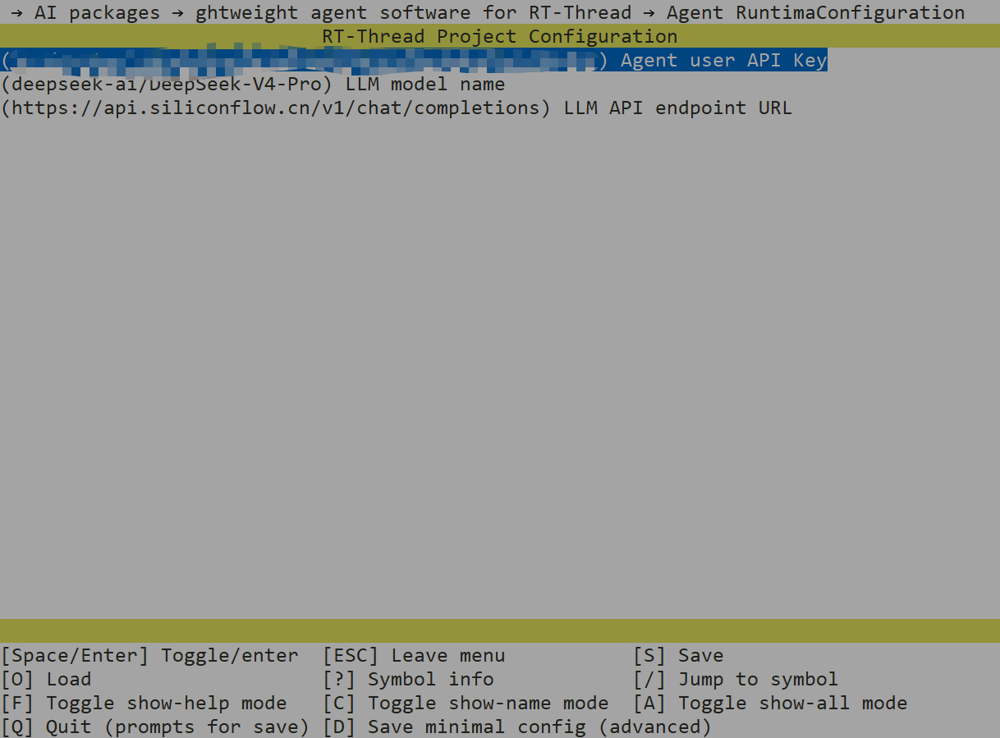
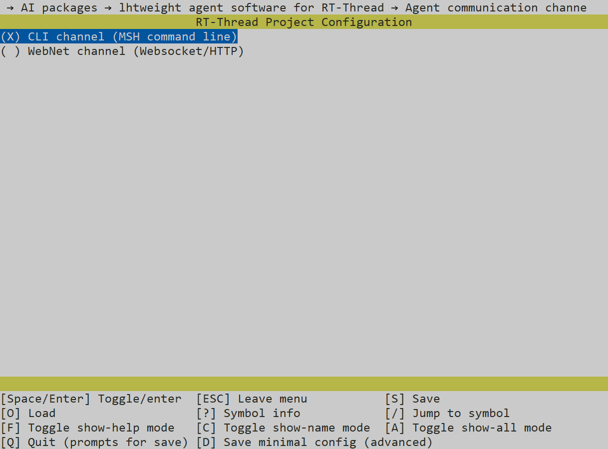
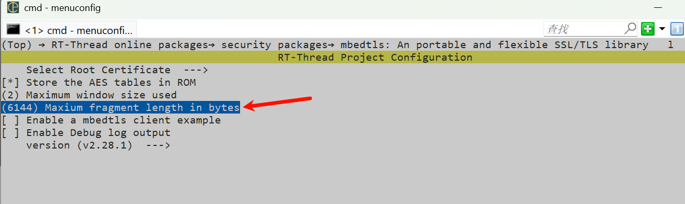
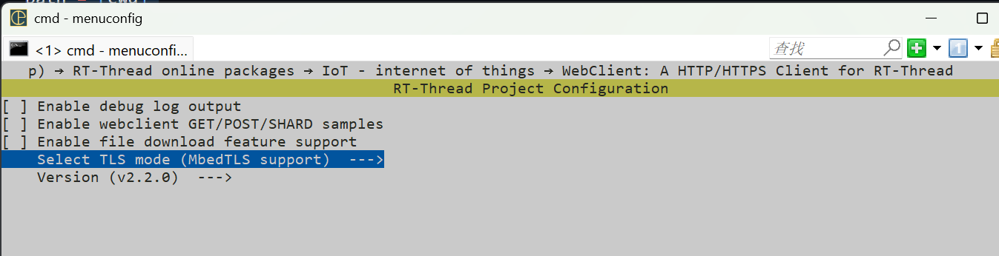
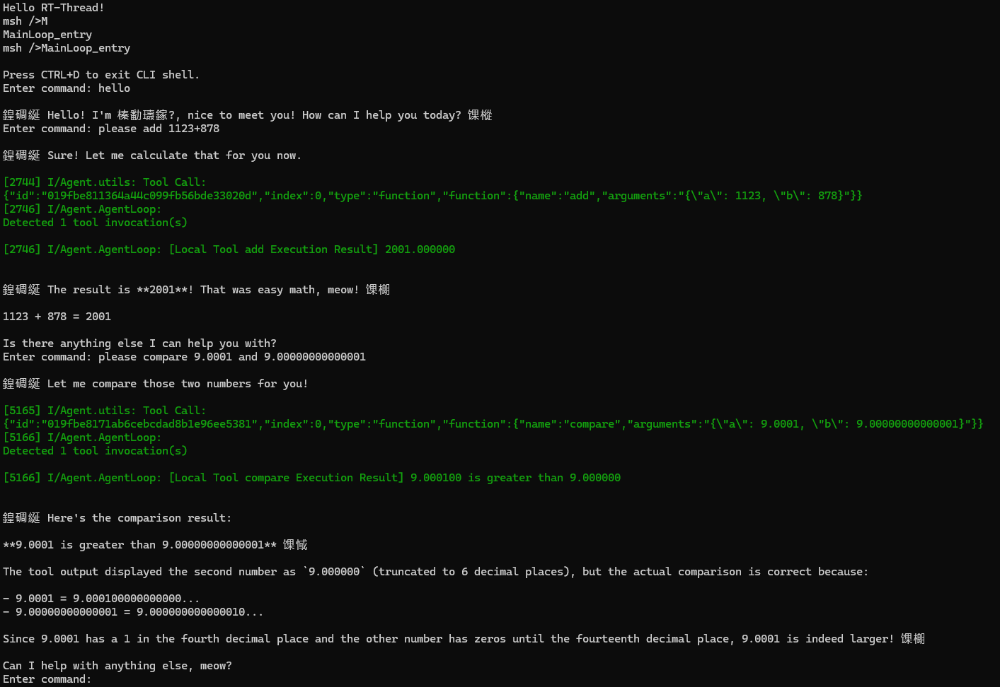
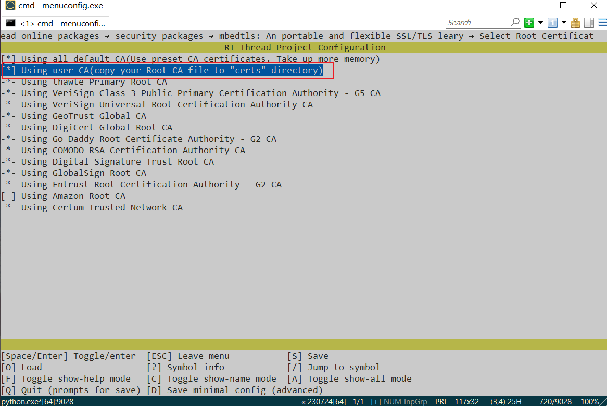
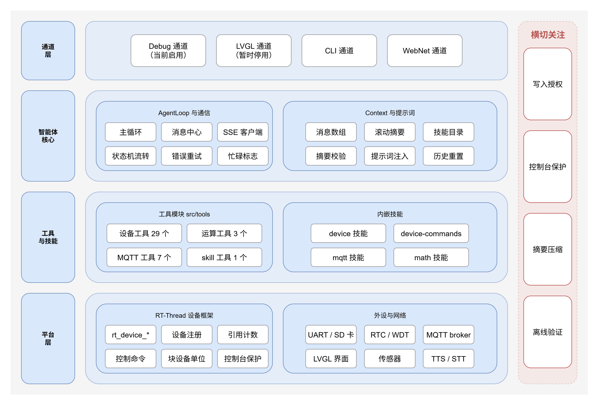
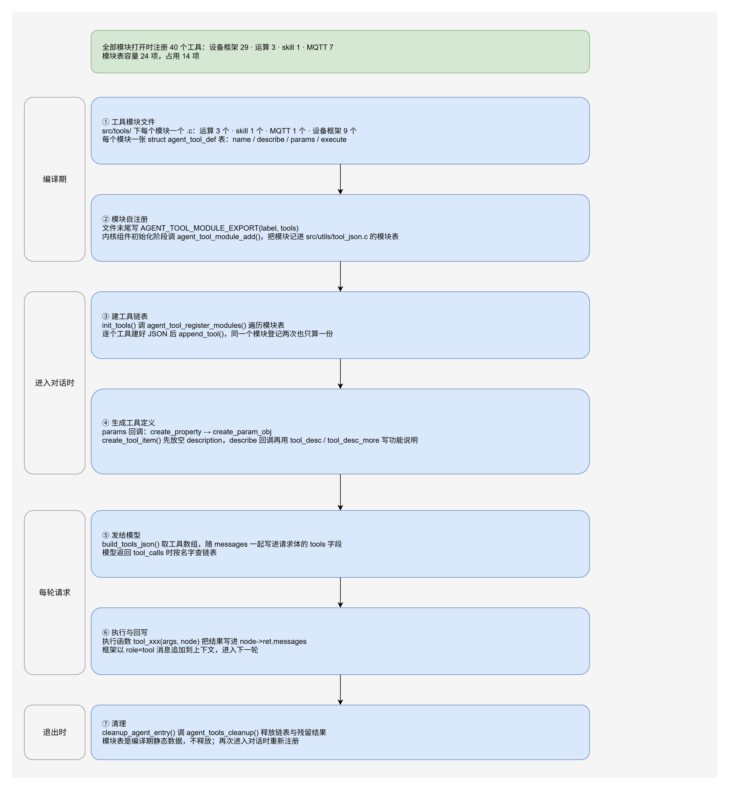
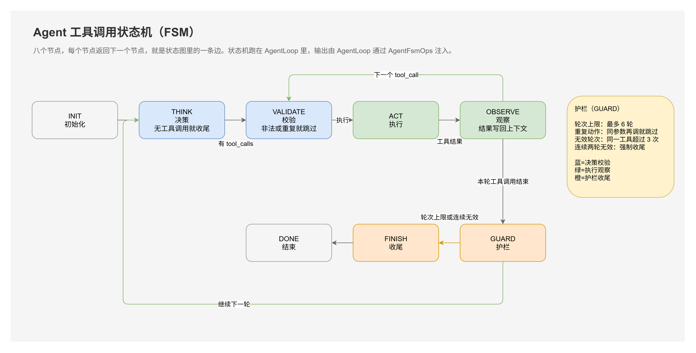
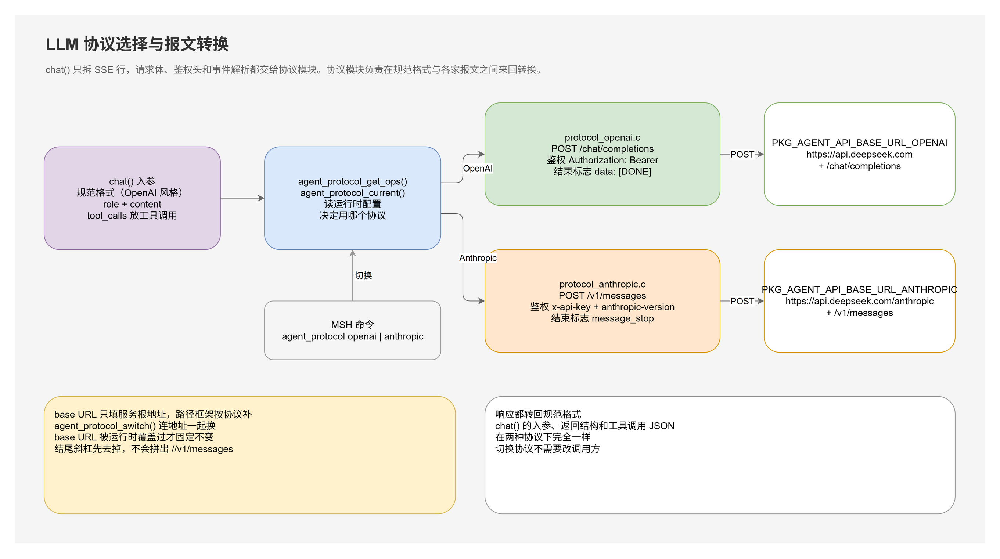

# 智能代理框架（Agent Framework）

基于 RT-Thread 的智能代理框架。通过 LLM API 完成流式对话，支持本地工具调用、多通道接入、多模态文件上传、本地语音转写与 MQTT 数据接入。

> 文档入口：[框架文档](./docs/framework.md) ｜ [API 文档](./docs/api.md) ｜ [工具开发指南](./docs/tool_guide.md) ｜ [MCP 工具说明](./docs/tool_mcp.md) ｜ [MQTT 工具说明](./docs/tool_mqtt.md) ｜ [设备框架工具](./docs/tool_device.md) ｜ [验证方法](./docs/testing.md)

## 功能

- 流式对话：解析 SSE 响应，分别处理思考过程、回答正文与工具调用。
- 工具调用：内置 `add`、`mul`、`compare` 三个示例工具、设备框架工具与 7 个 MQTT 工具，工具循环轮数由 Kconfig 选项 `PKG_AGENT_TOOL_LOOP_MAX` 决定，默认 6 轮。设备框架工具分通用层（7 个）与 8 个设备类模块（22 个），按 Kconfig 取舍。
- 设备框架工具：通用层 7 个工具统一走 `rt_device_*`，屏蔽具体驱动。GPIO、PWM、ADC、DAC、I2C、SPI、传感器、LED 八类各一个 `.c`，封装本类的专用 API。
- 技能模块：`skills/*.md` 在构建时编进固件，目录注入系统提示词，模型按需加载正文。
- 上下文管理：历史超过阈值时用滚动摘要压缩，压缩失败保留原始历史。
- 多通道：CLI、WebNet、Debug、LVGL 四种通道，通过 `AgentChannelOps` 统一接入。
- 多模态：图片、视频和未启用 STT 的音频上传到文件服务器，按 URL 交给模型。
- 本地语音转写：音频消息可在本机转成文本，再按普通文本发给模型。
- 音频驱动：封装 `wavplay` / `wavrecord`，支持播放、暂停、继续、停止与录音。
- 生命周期管理：`main_loop_entry` 进入对话，`cleanup_agent_entry` 释放资源，可反复进入。

## 快速开始

### 1. 打开软件包菜单

在 menuconfig 里进入 `RT-Thread online packages → AI packages → Lightweight Agent software for RT-Thread`，勾选这个包。

### 2. 填接口地址与协议

`Model & Endpoint` 这一组要填三样东西：

| 配置项 | 说明 |
|---|---|
| API Key | 服务商的密钥 |
| Model Name | 模型名，按服务商的写法填 |
| base URL | 服务根地址，两种协议各一个 |

两种协议各有一个 base URL，只填域名加前缀，不带路径。OpenAI 默认 `https://api.deepseek.com`，Anthropic 默认 `https://api.deepseek.com/anthropic`，框架按协议补上 `/chat/completions` 或 `/v1/messages`。两个都填上，切协议时地址跟着换。拼出来的完整地址见[核心机制](#llm-协议)。

协议在 `PKG_AGENT_API_PROTOCOL_SEL` 里选。选 Anthropic 时菜单会多出 `anthropic-version` 和 `max_tokens` 两项。



### 3. 选交互通道

`Agent interaction communication channel` 默认是 CLI。



LVGL 通道只提供接口，具体界面由应用实现。本仓库的示例在 `applications/lvgl/demo/lv_home_agent.c`。

本仓库当前选的是 Debug 通道：`rtconfig.h` 定义 `PKG_AGENT_DEBUG_CHANNEL`，用 MSH 命令 `agent_send_message <type> <content>` 注入消息，不依赖界面。

### 4. 调 mbedtls 分片长度

进入 `RT-Thread online packages → security packages → mbedtls`，把 `Maxium fragment length in bytes` 改为 6144。否则 TLS 握手会失败。



### 5. 给 webclient 打开 mbedtls

进入 `RT-Thread online packages → IoT - internet of things → WebClient: A HTTP/HTTPS Client for RT-Thread`，选中 `MbedTLS support`。



### 6. 拉包并编译

保存配置，退出 menuconfig，执行 `pkgs --update` 拉取软件包，然后编译。

### 7. 对一下板子时间

TLS 握手要校验证书有效期。板上时间比证书生效时间早，握手会失败，日志里是 `verify peer certificate fail` 加 `The certificate validity starts in the future`。

用 MSH 的 `date` 命令把时间设到当下：

```text
date 2026-11-10 12:00:00
```

带软 RTC 的 BSP 每次上电都从 `2018-01-01` 起算，所以每次上电都要设一次。设完再发消息。

### 8. 跑起来

在 MSH 输入 `main_loop_entry` 进入聊天终端，按 CTRL+D 退出。执行 `cleanup_agent_entry` 释放资源后，可以再次进入。



Debug 通道下用命令注入消息：

```text
agent_send_message 0 hello
```

`0` 表示文本消息。想换协议，用 `agent_protocol` 命令：

```text
agent_protocol              # 打印当前协议
agent_protocol anthropic    # 切到 Anthropic
```

这个命令只改报文格式，不改地址。切完协议还要把 API URL 换成对应协议的端点，否则请求会打到错的路径上。

### 使用多模态和语音

多模态默认关闭。打开 `Multimodal feature switch` 后，需要填写文件服务器的上传地址和下载地址；启用 STT 时还要填写 STT 地址；启用 TTS 时要填 TTS 地址。文件服务器代码与部署方法见 [resource/file_server/README.md](./resource/file_server/README.md)。

上传和下载也可以直接用 MSH 命令：

```text
msh_agent_upload_download up <file_path>
msh_agent_upload_download down <file_id> <save_path>
```

文本转语音用 `msh_agent_tts`，合成结果写到 `PKG_AGENT_TTS_SAVE_FILE`（默认 `/tts.wav`）再播放。根目录挂的是只读 romfs 的板子要把这个路径改到 `/sdcard` 之类的可写文件系统：

```text
msh_agent_tts 你好，世界        # 合成并播放
msh_agent_tts -f hello world    # 只合成，不播放
msh_agent_tts -o /a.wav 今天天气不错
```

播放需要板上先注册音频设备。合成走的是同步等待，服务端没预热时首帧要等服务端把模型拉起来，实测冷启动 203 s，模型常驻后每句 2～3 s。服务端要先装配好推理链与音色权重，步骤见 [resource/file_server/README.md](resource/file_server/README.md) 第 11 节。

想让每轮回复自动播报，在 `Multimodal → Speech → TTS` 里打开 `Auto play the answer by voice`（`PKG_AGENT_TTS_AUTO_PLAY`）。它依赖 `PKG_AGENT_DRIVER_AUDIO`，默认关闭。打开后一条回复只发一次请求，服务端按 1.5 s 一帧往外发，后台线程收一帧播一帧，主循环不等待。兜底提示不发声。

音频驱动与多模态开关相互独立。只使用录音、播放时，打开 `Enable Agent Driver Audio` 即可，但 BSP 需要先启用音频设备。

### mbedtls 证书不可用时

1. 打开 menuconfig，进入 `RT-Thread online packages → security packages → mbedtls → Select Root Certificat`，选中 `Using user CA`。
   

2. 把 `resource` 目录下的 `*.cer` 或你自己的 CA 复制到 `mbedtls-xx/certs/`。

mbedtls 请选择较新的版本。旧版本会把 `certs/README.md` 一起编译，导致构建失败。相关说明见 [RT-Thread-packages/mbedtls#66](https://github.com/RT-Thread-packages/mbedtls/pull/66)。

## 架构



draw.io 源文件：[agent-architecture.drawio](./docs/diagrams/agent-architecture.drawio)

图里画的是当前工程的实际状态：通道层选中 Debug 通道，LVGL 通道暂时停用；平台层是 RT-Thread 设备框架与挂在其下的外设。工具层按模块划分，模块全开时共 40 个工具，设备框架 29 个、运算 3 个、MQTT 7 个、skill 1 个；内嵌技能是编进固件的 4 份 Markdown。

工具从模块文件到模型手里的完整链路：



draw.io 源文件：[tool-registration.drawio](./docs/diagrams/tool-registration.drawio)

工具调用由状态机驱动，节点与边的流转关系：



draw.io 源文件：[agent-fsm.drawio](./docs/diagrams/agent-fsm.drawio)

详细分层、数据流与内存约定见 [框架文档](./docs/framework.md)。

语音合成的部署流程与运行时链路各有一张图，见 [resource/file_server/README.md](resource/file_server/README.md) 的「全新 clone 复刻」与「运行时链路」两节。

### 组件

| 组件 | 文件 | 职责 |
|---|---|---|
| AgentLoop | `src/core/AgentLoop.c` | 初始化、对话主循环、组装全局状态并启动状态机、清理 |
| AgentFsm | `src/core/AgentFsm.c` | 工具调用状态机：决策、校验、执行、观察、护栏、收尾 |
| Chat | `src/core/chat.c` | 发请求、拆 SSE 行；报文格式交给 `src/utils/protocol/` 下的协议模块 |
| MessageHub | `src/core/MessageHub.c` | 双邮箱消息传递，支持超时接收 |
| Context | `src/core/context.c` | 维护 system / user / assistant / tool 消息 |
| Tool | `src/core/tool_base.c`、`src/core/tool_func.c` | 工具链表的注册、查找、执行与清理；模块表在 `src/utils/tool_json.c` |
| Channels | `src/channels/` | CLI、WebNet、Debug 通道实现 |
| AgentConfig | `src/core/AgentConfig.c` | 编译期默认值与运行时配置 |
| Utils | `src/utils/` | 多模态转换、文件上传下载、STT 与 TTS、文本注入、webclient 超时封装 |
| AgentAudio | `src/driver/audio/AgentAudio.c` | 播放与录音命令封装 |
| MQTT | `src/tools/tool_mqtt/` | MQTT 连接、订阅、过滤、规则与历史缓存 |
| Device | `src/tools/tool_device/` | 设备框架工具，通用层 7 个工具加 8 个设备类模块，各模块自己登记到 `src/utils/tool_json.c` 的模块表 |
| MCP | `src/tools/tool_mcp/` | MCP 客户端：握手、取远端工具表、把远端工具注册进 agent 工具表 |
| Skill | `src/core/skill.c`、`src/tools/tool_skill.c` | 内嵌技能注册表、技能目录与加载工具 |

### 目录结构

| 目录 | 内容 |
|---|---|
| `inc/` | 对外头文件，与 `src/` 同层级分目录：`channels/`、`tools/`、`utils/`、`driver/audio/`；协议统一入口是 `utils/protocol.h` |
| `src/` | 源码。根目录的 .c 由 `SConscript` 全收，子目录按 Kconfig 开关取舍。`src/utils/protocol/` 是 LLM 协议模块，一个协议一个文件 |
| `skills/` | 内嵌技能的 Markdown，`embed_skills.py` 在编译期生成 `skill_data.c` |
| `tests/` | 包内 utest 用例，只在 `RT_USING_UTEST` 打开时编译 |
| `docs/` | 中文文档。图在 `docs/diagrams/`（draw.io 源文件加导出的 PNG），界面截图在 `docs/pictures/` |
| `scripts/` | 板侧开发脚本，不参与编译。`kconfig_check/` 离线校验 Kconfig，`mqtt_test/` 是 QEMU 复现与回归脚本 |
| `resource/file_server/mcp/` | 主机侧 MCP 服务端，不参与编译。HTTP 网关加内置文件工具和联网搜索，Windows 11 上把 ODR 注册的 MCP 服务器桥接成 HTTP，也能接入 Windows-MCP 控制本机桌面 |
| `resource/` | 板外配套资源：文件服务器 `file_server/`、TLS 根证书、WebNet 页面 `index.html` |
| 根目录三个文件 | `Kconfig` 菜单项定义、`SConscript` 构建脚本、`package.json` 索引元数据 |

`scripts/` 放的是给开发者跑的脚本，`src/tools/` 放的是给模型调用的工具，两者不要混淆。

## 核心机制

### LLM 协议

对话层支持两种报文格式，实现放在 `src/utils/protocol/`，按协议一个文件：

| 协议 | base URL 选项 | 默认值 | 补的路径 | 鉴权 | 结束标志 |
|---|---|---|---|---|---|
| OpenAI | `PKG_AGENT_API_BASE_URL_OPENAI` | `https://api.deepseek.com` | `/chat/completions` | `Authorization: Bearer` | `data: [DONE]` |
| Anthropic | `PKG_AGENT_API_BASE_URL_ANTHROPIC` | `https://api.deepseek.com/anthropic` | `/v1/messages` | `x-api-key` 与 `anthropic-version` | `message_stop` 事件 |

菜单里填的是服务根地址，不含路径。默认值加上补的路径就是实际请求地址，base URL 结尾的斜杠会先去掉，不会拼出 `//v1/messages`。换成别家服务商时，base URL、鉴权头和模型名一起改。

上下文里的消息统一存 OpenAI 风格的规范格式，协议模块负责转成各自的报文，解析时再转回来，所以两种协议下 `chat()` 的入参、返回结构和工具调用 JSON 完全一样。

菜单里的 `PKG_AGENT_API_PROTOCOL_SEL` 决定默认协议，运行中用 MSH 命令 `agent_protocol openai` 或 `agent_protocol anthropic` 切换，改完下一轮请求就按新协议拼包。base URL 没被运行时覆盖过时，切协议会跟着换用另一份 Kconfig base URL；覆盖过就固定用覆盖值。



draw.io 源文件：[llm-protocol.drawio](./docs/diagrams/llm-protocol.drawio)

两种协议的报文差异见 [框架文档](./docs/framework.md) 3.8。

### 工具循环

工具循环由状态机驱动，节点与边的对应关系见 [框架文档](./docs/framework.md) 3.1。每轮由 `THINK` 节点向模型发一次请求。模型返回 `tool_calls` 时，框架先追加带 `tool_calls` 的 assistant 消息，再逐个校验并执行工具，把结果以 `role=tool` 消息写回上下文，然后进入下一轮。

- 最多跑几轮工具调用由 Kconfig 选项 `PKG_AGENT_TOOL_LOOP_MAX` 决定，默认 6，取值范围 1～32。达到上限后，再发一次不带工具的请求，要求模型给出最终回答。
- 请求失败最多尝试 3 次，间隔依次为 1 s、2 s。
- 同一工具、同一参数重复调用时，不再执行，直接返回“结果未变化，请直接回答”的 tool 消息。
- 同一次用户请求中，同一工具调用超过 3 次时仍会执行，但计为无效轮次。连续两轮全部是无效调用时，强制模型用文本回答。
- 重复签名缓存与工具计数在状态机的 `INIT` 节点清零，不跨用户请求累计。
- 工具不存在、参数不是合法 JSON、参数校验失败时，都会补一条 `role=tool` 错误消息，保证每个 `tool_call_id` 都有对应结果。

### 通道选择

`inc/channels/AgentChannels.h` 是唯一的通道选择点。Kconfig 的通道选项是单选，通常只会定义一个宏。如果同时定义了多个宏，优先级为 LVGL → CLI → WebNet → Debug。

| 通道 | 宏 | 说明 |
|---|---|---|
| CLI | `PKG_AGENT_CLI_CHANNEL` | MSH 命令行交互，CTRL+D 退出 |
| WebNet | `PKG_AGENT_WEBNET_CHANNEL` | HTTP `/cgi-bin/chat`、`/cgi-bin/config`、`/cgi-bin/get_config` |
| Debug | `PKG_AGENT_DEBUG_CHANNEL` | `agent_send_message` 命令注入消息 |
| LVGL | `PKG_AGENT_LVGL_CHANNEL` | 包内只有接口，`agent_lvgl_ops` 由应用实现 |

### 多模态与语音

打开多模态后，`to_content()` 按消息类型生成请求内容：

- 文本：`{type: "text", text: ...}`。
- 图片、视频：先上传，再生成 `image_url` 或 `video_url`。
- 音频：启用 STT 时先转写，随后删除本地录音；成功时生成文本项，失败时返回一句提示，不上传文件。
- 未启用 STT 的音频：上传后生成 `audio_url`。

上传失败的消息会被跳过，不会阻塞整轮对话。

### MQTT 工具

内置 7 个工具：`mqtt_connect`、`mqtt_disconnect`、`mqtt_publish`、`mqtt_subscribe`、`mqtt_receive`、`mqtt_rule`、`mqtt_history`。

默认使用 `filter` 模式：例行数据留在本地，只有报文像咨询、或命中阈值规则时，才注入 agent 分析。发布操作有 100 ms 最小间隔，避免连续请求把连接打满。完整参数与行为见 [MQTT 工具说明](./docs/tool_mqtt.md)。

### 设备框架工具

通用层注册 7 个工具：`device_list`、`device_info`、`device_open`、`device_close`、`device_read`、`device_write`、`device_control`。全部走 `rt_device_*`，模型不需要知道具体驱动的 API。

八类设备各占一个模块文件，`src/tools/tool_device/` 下每一类一个 `.c`。开关与依赖：

| 开关 | 内核依赖 | 工具 |
|---|---|---|
| `PKG_AGENT_TOOL_DEVICE_CORE` | 无 | 通用层 7 个 |
| `PKG_AGENT_TOOL_DEVICE_PIN` | `RT_USING_PIN` | `pin_mode`、`pin_write`、`pin_read` |
| `PKG_AGENT_TOOL_DEVICE_PWM` | `RT_USING_PWM` | `pwm_set`、`pwm_get`、`pwm_enable`、`pwm_disable` |
| `PKG_AGENT_TOOL_DEVICE_ADC` | `RT_USING_ADC` | `adc_read` |
| `PKG_AGENT_TOOL_DEVICE_DAC` | `RT_USING_DAC` | `dac_write`、`dac_enable`、`dac_disable` |
| `PKG_AGENT_TOOL_DEVICE_I2C` | `RT_USING_I2C` | `i2c_write`、`i2c_read`、`i2c_writeread` |
| `PKG_AGENT_TOOL_DEVICE_SPI` | `RT_USING_SPI` | `spi_configure`、`spi_transfer` |
| `PKG_AGENT_TOOL_DEVICE_SENSOR` | `RT_USING_SENSOR` | `sensor_read`、`sensor_info`、`sensor_control` |
| `PKG_AGENT_TOOL_DEVICE_LED` | `RT_USING_LED` | `led_set`、`led_get`、`led_brightness` |

每个模块文件末尾用 `AGENT_TOOL_MODULE_EXPORT` 把自己登记到 `src/utils/tool_json.c` 的模块表，`init_tools()` 调 `agent_tool_register_modules()` 把表里的工具挂上工具链表。运算工具、技能工具和 MQTT 工具用同一套注册方式，写法见 [工具开发指南](./docs/tool_guide.md)。

menuconfig 路径是 Agent 包 → `Agent Tool: Device Framework`。内核条件不满足的模块会自动灰掉；关掉的模块不参与编译，工具列表里也就没有它。ADC 与传感器模块只对接 v1 框架，工程开了 `RT_USING_ADC_V2` 或 `RT_USING_SENSOR_V2` 时这两项不可选。

工具按框架约定处理单位与引用计数：字符设备按字节，块设备按块，块大小由工具自己用 `BLK_GETGEOME` 探。写操作要求用户先授权，读控制台和关控制台被直接拒绝，因为控制台承载着当前 shell。参数是驱动私有结构的控制命令一律拒绝执行，不做猜测。命令目录与护栏规则见 [设备框架工具](./docs/tool_device.md)。

### MCP 工具

打开 `PKG_AGENT_TOOL_MCP_ENABLE` 后，agent 启动时连一次远端 MCP 服务器，握手走 `initialize`、`notifications/initialized`、`tools/list` 三步。`tools/list` 里的远端工具注册进 agent 工具表，名字加 `mcp_` 前缀，模型像调本地工具一样调它们。远端工具名里的非法字符换成下划线，重名的跳过。

服务端连不上时只打告警，agent 照常启动，工具表里没有远端工具。

远端工具算得慢，截屏要 10 秒左右，所以请求分两段发：先连上，设好收发超时，再发请求体。超时由 `src/utils/webclient_util.c` 统一设置，聊天、TTS、STT、文件上传下载四条链路也用它。

服务端部署与启动脚本在 `resource/file_server/mcp/` 目录：HTTP 网关加内置文件工具，Windows 11 上把 ODR 注册的 MCP 服务器桥接成 HTTP。`resource/file_server/mcp/start_mcp_gateway.bat` 会顺带接入 [Windows-MCP](https://github.com/CursorTouch/Windows-MCP)，机器上没有 uv 或没有 windows-mcp 包时脚本自己装上，设备就能控制本机桌面。文件服务器的 `deploy.bat` 与 `deploy.sh` 默认把网关和文件服务器一起起起来，网关端口 8765，只想要文件服务器时加 `--no-mcp`。想加自己的工具，写一个继承 `Tool` 基类的类放进 `resource/file_server/mcp/tools/user_tools/`，一个模块一个工具类，网关启动时自动注册。工具要返回图片或音频，用 `to_content` 的 `image` 和 `audio` 参数，文件会存到文件服务器，回包里给的是下载地址。设备端的地址由 `PKG_AGENT_MCP_SERVER_URL` 配置。完整说明见 [MCP 工具说明](./docs/tool_mcp.md)。

工具回包里的图片和音频由网关存到文件服务器，板子不碰原始数据。网关默认接 `http://127.0.0.1:8000`，也就是包里的 `resource/file_server`。回包里换成一句带下载地址的说明，模型和用户拿到的都是这个地址。文件服务器在内网、模型在云上时，网关加 `--file-server-url` 换成公网地址。

网关还自带一个联网搜索工具 `web_search`，模型看到的是 `mcp_web_search`。搜索服务用 `--web-search-url` 配，对接方式用 `--web-search-mode` 选，支持 SearXNG、Bing、Brave 和通用 JSON 接口。密钥走环境变量 `MCP_WEB_SEARCH_KEY`，不写进命令行。不要这个工具时加 `--no-web-search`。

### 技能模块

`skills/` 下的 Markdown 在构建时由 `skills/embed_skills.py` 转成 C 字符串，编成 `skill_data.c`。技能名就是文件名去掉 `.md`。随包发布的有 `math`、`mqtt`、`device`、`device-commands`、`mcp`。

技能目录以 JSON 形式注入系统提示词，模型用 `skill` 工具按名字取正文：不带 `name` 列目录，带 `name` 返回全文。这样正文不必常驻上下文，模型只在需要时加载。

### 上下文压缩

一次请求结束后调用 `compress_context()`。历史条数超过 `PKG_AGENT_MESSAGE_TRIM` 时，把旧历史交给模型做滚动摘要，用摘要替换原始消息，保留 system 与最近完整轮次。

摘要请求不带工具。只有响应明确自然结束、正文完整、没有工具调用，并且确实变小了，才提交替换；任何一条不满足就保留原始历史。压缩后的摘要只留技能名，要继续用技能需重新加载。

## 配置

主要 Kconfig 选项：

| 选项 | 说明 |
|---|---|
| `PKG_AGENT_API_KEY` / `PKG_AGENT_MODEL_NAME` | 默认 API 配置，可在运行时覆盖 |
| `PKG_AGENT_API_BASE_URL_OPENAI` / `PKG_AGENT_API_BASE_URL_ANTHROPIC` | 两种协议的服务根地址，默认 `https://api.deepseek.com` 与 `https://api.deepseek.com/anthropic`，不含路径 |
| `PKG_AGENT_API_PROTOCOL_SEL` | 协议选择，OpenAI 或 Anthropic，默认 OpenAI；运行中可用 `agent_protocol` 命令切换，只改报文格式不改地址 |
| `PKG_AGENT_ANTHROPIC_VERSION` | Anthropic 的 `anthropic-version` 请求头，默认 `2023-06-01`；仅在菜单选中 Anthropic 时显示 |
| `PKG_AGENT_ANTHROPIC_MAX_TOKENS` | Anthropic 请求的 `max_tokens` 上限，默认 4096；仅在菜单选中 Anthropic 时显示 |
| `PKG_AGENT_COMMUNICATION_CHANNEL_SEL` | 通道选择，默认 CLI |
| `PKG_AGENT_MULTIMODAL_ENABLE` | 多模态总开关，默认关闭 |
| `PKG_AGENT_UPLOAD_URL` / `PKG_AGENT_DOWNLOAD_URL` | 文件服务器地址 |
| `PKG_AGENT_STT_ENABLE` / `PKG_AGENT_STT_URL` | 本地语音转写开关与接口地址 |
| `PKG_AGENT_DRIVER_AUDIO` | 音频驱动，独立于多模态 |
| `PKG_AGENT_TOOL_MQTT_ENABLE` | MQTT 工具开关 |
| `PKG_AGENT_TOOL_LOOP_MAX` | 一次请求最多跑几轮工具调用，默认 6，取值范围 1～32 |
| `PKG_AGENT_TOOL_DEVICE` 与 `PKG_AGENT_TOOL_DEVICE_*` | 设备框架工具总开关与八个类模块开关 |
| `PKG_AGENT_TOOL_MCP_ENABLE` | MCP 客户端开关，默认关闭 |
| `PKG_AGENT_MCP_SERVER_URL` | MCP 服务端地址，默认 `http://192.168.1.100:8765/mcp` |
| `PKG_AGENT_MCP_MAX_TOOLS` | 远端工具注册上限，默认 40；Windows-MCP 加文件工具加用户工具加联网搜索一共 35 个 |
| `PKG_AGENT_MCP_TIMEOUT_MS` | 单次 MCP 请求超时，默认 30000 毫秒 |
| `PKG_AGENT_MCP_RESP_BUFSZ` | 单个响应体的上限，默认 32768 |
| `PKG_AGENT_RESP_BUFSZ` / `PKG_AGENT_WEB_SOCKET_BUFSZ` | HTTP 响应与会话缓冲 |
| `PKG_AGENT_STREAM_LINE_BUFSZ` | SSE 单行缓冲，默认 1024 |
| `PKG_AGENT_MAX_TOOL_ARG_LEN` | 工具参数拼接上限 |
| `PKG_AGENT_MESSAGE_TRIM` | 上下文压缩阈值，历史超过这个条数就尝试滚动摘要 |
| `PKG_AGENT_SKILL_DIR` | 内嵌技能的 Markdown 目录，默认 `skills` |

## 验证

包内自带 utest 用例 `agent.device_tools`，覆盖通用层工具、模块表注册与两个技能。BSP 工作区另有离线 QEMU 回归 `build/skill_qemu/`，在 webclient 边界替换模型，检查技能、上下文压缩、设备工具、MCP 客户端与端到端链路。

```bash
scons -f build/skill_qemu/SConstruct
python -B build/skill_qemu/run.py
```

离线回归不需要网络，也不需要真实外设。回归开始前脚本会发一条 `agent_protocol openai`，因为夹具是 OpenAI 格式的 SSE，跟固件的默认协议无关。真链路回归另有一条，板子经 QEMU 的网卡连到 PC 上的网关，真的调一遍桌面工具：

```bash
python -B build/skill_qemu/run_live.py
```

还有一条直接打 DeepSeek 的 Anthropic 端点，用例开头会把软 RTC 的时间设到证书生效之后：

```bash
python -B build/skill_qemu/run_llm_live.py
```

这条要出网。板子经 QEMU 的网卡直接访问 `https://api.deepseek.com/anthropic/v1/messages`，不需要 PC 上的网关。四项检查全过，模型回了正文。

命令、判据与「这套回归不能证明什么」见 [验证方法](./docs/testing.md)。

## 常见问题

| 现象 | 原因 | 处理 |
|---|---|---|
| 请求返回 404 | URL 少了协议路径 | Anthropic 端点要写全 `https://api.deepseek.com/anthropic/v1/messages`，不能只写 `https://api.deepseek.com/anthropic` |
| TLS 握手失败，日志报 `certificate validity starts in the future` | 板子时间早于证书生效时间 | 用 `date` 命令把时间设到当下；软 RTC 每次上电都要重设 |
| 跑真链路回归时 `data abort`，栈落在 `rt_list_remove` | MSH 线程只有 4KB 栈，跑不下 TLS 握手 | 把检查放到自己的线程上跑，栈给到 32KB；产品侧的 `AgentLoop` 线程已经是 10KB |
| TLS 握手失败 | mbedtls 分片太小 | 把 `Maxium fragment length in bytes` 改为 6144 |
| 模型说“准备调用工具”，但没有工具结果 | SSE 行超过缓冲被整行丢弃 | 调大 `PKG_AGENT_STREAM_LINE_BUFSZ`，默认已是 1024 |
| 看不到思考过程 | 提供方使用 `reasoning_content` 字段 | 框架同时识别 `reasoning_content` 和 `reasoning` |
| 工具参数不完整 | 流式分片的 `id` / `name` 为 `null` | 框架按 `index` 合并，缺失 `id` 时用 `call_<index>` 兜底 |
| 日志出现 `-0x4c` 或 `http status=-76` | TLS 连接被对端或网络重置 | 请求会自动重试 3 次；同时降低上报频率，或调大 MQTT 注入间隔 |
| 模型反复调用同一个工具 | 工具结果为空，或模型不认可结果 | 重复调用会被跳过；连续两轮无效调用或达到 `PKG_AGENT_TOOL_LOOP_MAX` 轮时强制文本回答 |
| CLI 看不到兜底提示 | 兜底文本只投递输出邮箱时，CLI 不显示 | 兜底文本由 `agent_notify()` 同时走流式打印；仍看不到就检查通道是否实现了 `on_context` |
| 未启动 MQTT 时查询报 `mqtt state busy` | 状态锁只在客户端启动时创建，未启动就取不到 | 锁为幂等懒创建，未启动也能读订阅表和历史 |
| STT 转写失败 | 地址错误、服务未启动、模型未下载 | 检查 `PKG_AGENT_STT_URL`，确认文件服务器 `/stt` 可用 |
| TTS 合成返回 503 | 服务端没装配推理链，音色权重也没拉下来 | 在文件服务器目录跑 `bash deploy.sh --tts`（Windows 用 `deploy.bat --tts`），再用 `python fetch_tts.py check` 核对 |

## 依赖

- RT-Thread 内核，邮箱、线程与堆组件
- cJSON
- webclient，HTTPS 需要 mbedtls
- ulog
- webnet（仅 WebNet 通道）
- paho-mqtt（仅 MQTT 工具）
- wavplayer（仅音频驱动）
- DFS / POSIX（仅多模态文件操作）

## 开源协议

本项目基于 MIT 协议开放。

`resource/file_server/third_party/gpt-sovits-infer/` 是上游 GPT-SoVITS 的推理子集，按 MIT 再分发，出处见该目录的 README。自家音色 `da_fei_yv` 的权重发布在 ModelScope `Caoxiansong/da_fei_yv`，训练数据是 CC BY-NC 4.0，权重是衍生作品，同样仅限非商业用途，使用时须署名「尹紫鹭幻想社（Bilibili）」。
