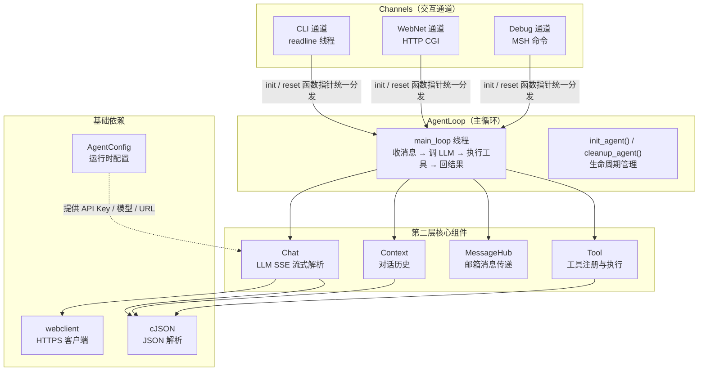
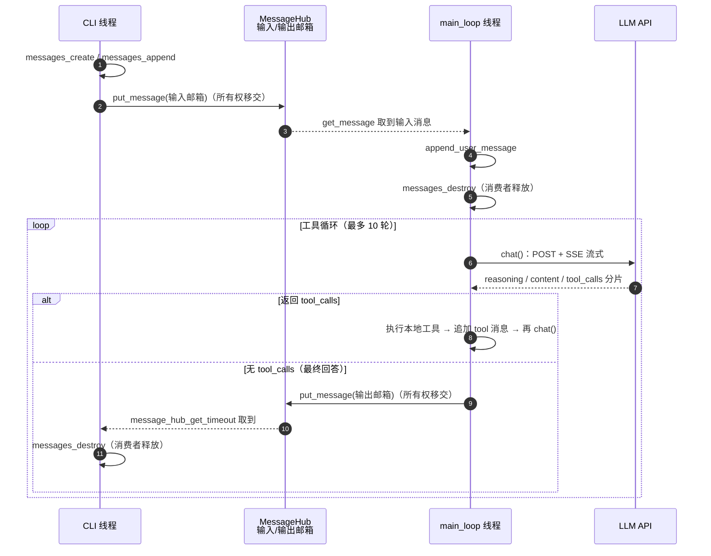
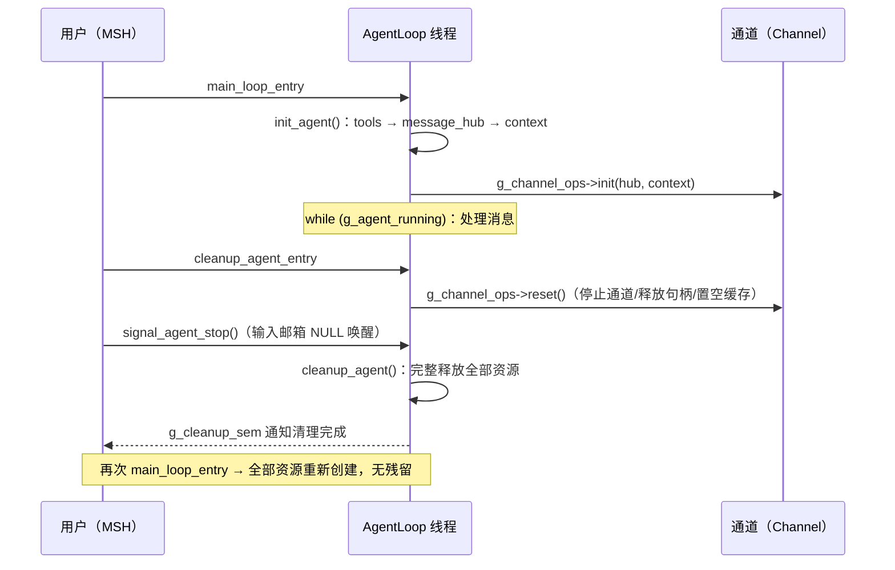

# Agent 框架文档

> 基于 RT-Thread 的智能代理（Agent）框架：通过 LLM API 交互、工具调用、多通道交互与完整生命周期管理。
> 本文档描述框架的架构、组件、数据流与内存管理约定。API 细节见 [api.md](./api.md)。

---

## 1. 概述

本框架实现一个可对话、可调用工具的智能代理，运行于 RT-Thread 实时操作系统上。核心能力：

- **对话**：与 LLM API 流式交互（SSE），支持思考过程、回答正文与工具调用三种流式数据。
- **工具系统**：注册、查找、执行本地工具（内置 add / mul / compare 示例）。
- **上下文管理**：按角色（system/user/assistant/tool）维护对话历史，支持清空与裁剪。
- **多通道交互**：CLI / WebNet / Debug 三种通道，通过统一的通道 ops 函数指针接入。
- **生命周期**：支持"进入对话 → 对话 → 清理 → 再次进入"的完整循环，清理后内存回到基线。
- **多模态（可选）**：文件上传/下载，通过独立文件操作线程与文件服务器交互。

---

## 2. 架构总览



### 分层职责

| 层 | 组件 | 职责 |
|---|---|---|
| 顶层调度 | `AgentLoop` | 初始化/清理全部组件；对话主循环；工具调度 |
| 第二层 | `MessageHub` | 基于 RT-Thread 邮箱的组件间消息传递 |
| 第二层 | `Context` | 对话历史：追加/清空/裁剪各类角色消息 |
| 第二层 | `Chat` | LLM API 通信，SSE 流式解析（思考/正文/工具调用） |
| 第二层 | `Tool` | 工具注册、查找、执行、结果回填 |
| 通道 | `CLI / WebNet / Debug` | 外部交互界面，通过 `AgentChannelOps` 接入 |
| 基础 | `AgentConfig` / `Utils` / `Prompt` | 运行时配置、工具函数、系统提示词 |

---

## 3. 核心组件

### 3.1 AgentLoop（代理主循环）

**文件**：`src/AgentLoop.c`

- `main_loop` 线程（栈 10KB，优先级 10）：阻塞等待输入消息 → `append_user_message` → `agent_loop` 执行对话 → 裁剪上下文。
- `agent_loop`：最多 10 轮工具循环。每轮调用 `chat()`；若返回无 tool_calls 的最终回答，投递输出消息并结束；若返回 tool_calls，逐个执行本地工具并把工具结果追加进上下文后进入下一轮。
- **生命周期命令**（MSH）：
  - `main_loop_entry`：创建并启动主循环线程（内含 `init_agent`）。
  - `cleanup_agent_entry`：停止通道 → 发送停止信号 → 等待主循环退出 → 清理全部资源。

### 3.2 MessageHub（消息中心）

**文件**：`src/MessageHub.c`、`include/MessageHub.h`

基于 RT-Thread 邮箱（mailbox）实现消息传递：

- **输入邮箱** `AgentInputMb`（容量 10）：通道 → 主循环。
- **输出邮箱** `AgentOutMb`（容量 10）：主循环 → 通道。
- 消息载体为 `Messages_t`（不定长消息数组，自动扩容）。
- **所有权约定**（见 §5）：`put_message` 入队即移交所有权；消费者（`main_loop` 或通道）取到后负责释放。

### 3.3 Context（上下文管理器）

**文件**：`src/context.c`、`include/context.h`

维护 `cJSON` 消息数组，角色包括 system / user / assistant / tool：

- 创建时自动构建系统提示词（`get_system_prompt`）。
- `append_user_message` / `append_assistant_message` / `append_tool_message`：追加各类消息。
- `clear_message`：清空并重建数组（需重新 `build_system_prompt`）。
- `trim_context(keep_items)`：保留系统提示词 + 最近 N 条消息，防止上下文无限膨胀。

### 3.4 Chat（LLM 通信）

**文件**：`src/chat.c`、`include/chat.h`

- 组装请求 JSON（model / messages / tools / max_tokens / stream），通过 webclient POST 到 API。
- 流式解析 SSE：`data: {...}` 行；解析 `delta.reasoning`（思考）、`delta.content`（正文）、`delta.tool_calls`（工具调用分片按 index 合并）。
- 30s 网络超时，避免网络卡死阻塞清理流程。
- 返回 `ChatResponse_t`（reasoning / context / tool_call），用后必须 `chat_response_free`。

### 3.5 Tool 工具系统

**文件**：`src/tool_base.c`、`src/tool_func.c`、`src/tools/*`

- 全局单例工具链表：`head` + 各 `AgentToolList` 节点。
- `init_tools()` 注册内置工具（add / mul / compare），`build_tools_json()` 构建工具定义数组。
- 工具执行函数签名：`void tool_xxx(cJSON *args, AgentToolNode_t node)`，结果写入 `node->ret.messages`。
- 生命周期：`agent_tools_cleanup()`（内部 `agent_tool_list_destroy()` + 复位注册标志）在清理时释放全部工具资源，再次进入时自动重新注册。

### 3.6 Channels（交互通道）

**文件**：`src/channels/*`、`include/channels/*`

三个通道实现相同的 **`AgentChannelOps`** 接口（见 `include/channels/AgentChannel.h`）：

```c
typedef struct AgentChannelOps {
    int  (*init)(MessageHub_t hub, Context_t ctx);  /* 绑定 hub/context */
    void (*reset)(void);                            /* 停止线程/置空缓存（幂等） */
} AgentChannelOps;
```

| 通道 | 宏开关 | ops 实例 | init | reset |
|---|---|---|---|---|
| CLI | `PKG_AGENT_CLI_CHANNEL` | `agent_cli_ops` | `agent_cli_channel`（创建 readline 线程） | `agent_cli_stop`（停止线程+释放句柄） |
| WebNet | `PKG_AGENT_WEBNET_CHANNEL` | `agent_webnet_ops` | `webnet_agent_channel_init`（包装 `webnet_agent_mode`，注册 CGI） | `agent_webnet_reset`（置空缓存指针） |
| Debug | `PKG_AGENT_DEBUG_CHANNEL` | `agent_debug_ops` | `agent_debug_channel`（绑定指针） | `agent_debug_reset`（置空缓存指针） |

- **单点宏选择**：`include/channels/AgentChannels.h` 中的 `AGENT_CHANNEL_OPS` 是唯一的通道判断点（`#ifdef PKG_AGENT_*_CHANNEL` 三选一），`AgentLoop` 通过 `g_channel_ops` 函数指针统一调用，调用点零 `#ifdef`。
- 未配置通道时 `AGENT_CHANNEL_OPS` 为 NULL，AgentLoop 安全跳过。

### 3.7 AgentConfig（运行时配置）

**文件**：`config/AgentConfig.c`、`config/AgentConfig.h`

- 编译期默认值来自 Kconfig 宏（`PKG_AGENT_API_KEY` / `PKG_AGENT_API_URL` / `PKG_AGENT_MODEL_NAME`）。
- 运行时可热更新：`agent_config_set()`；`get_dynamic_agent_*()` 优先返回运行时配置。
- 纯静态存储，无堆分配。

### 3.8 Utils 与多模态文件服务器

**文件**：`src/utils.c`、`include/utils.h`

- 通用工具：`format_text` / `create_content_array` / `to_content`（Messages → API content 格式）/ 工具 JSON 构建（`create_tool_item` / `create_param_obj` / `create_property`）。
- 多模态（`PKG_AGENT_MULTIMODAL_ENABLE`）：独立文件操作线程 + 两个消息队列，`agent_up_load` 上传返回 URL、`down_load` 下载；`to_content` 把音频/图片/视频消息转成 `{type, url}` 格式。

---

## 4. 数据流

### 4.1 一次完整对话



### 4.2 清理流程（cleanup_agent_entry → cleanup_agent）

1. `g_channel_ops->reset()`：停止通道线程、释放句柄、置空通道缓存指针（幂等）。
2. 向输出邮箱发送 NULL 哨兵，唤醒可能阻塞的输出等待。
3. `message_hub_destroy`：排空两个邮箱中残留的 `Messages_t` 并释放，再删除邮箱与 hub。
4. `agent_context_destroy`：释放上下文与消息数组。
5. `agent_tools_cleanup`：释放工具链表、工具定义 JSON、残留的工具结果消息，复位注册标志。
6. 多模态文件线程 deinit（如启用）。
7. 释放 `g_cleanup_sem` 通知清理完成。

---

## 5. 内存管理约定

| 对象 | 分配者 | 释放者 | 说明 |
|---|---|---|---|
| 输入 `Messages_t` | 通道 | **main_loop** | `put_message` 成功即移交所有权；通道仅在发送失败时释放 |
| 输出 `Messages_t` | `agent_loop` | **通道** | 投递输出邮箱后所有权归通道 |
| `ChatResponse_t` | `chat()` | 调用者 | 必须调用 `chat_response_free` |
| hub / 邮箱 | `message_hub_create` | `message_hub_destroy` | 销毁前排空邮箱 |
| context | `agent_context_create` | `agent_context_destroy` | — |
| 工具链表/JSON | `init_tools` | `agent_tools_cleanup` | 清理时整体释放，再次进入重新注册 |
| CLI 句柄/信号量 | `agent_cli_channel` | `agent_cli_stop` | reset 时释放 |
| 通道缓存指针 | 通道 init | 通道 reset | 置空防止悬垂 |
| HTTP 会话/缓冲 | `chat()` | `chat()` 内部 | webclient_close / web_free / cJSON_free |

**关键规则**：mailbox 是异步队列，`put_message` 只入队指针——**入队即交接所有权**，发送方不得在入队后释放，接收方取到后负责释放（防 use-after-free 与泄漏）。

---

## 6. 生命周期与"进入→清理→再进入"



支持无限循环。每次清理后堆内存回到基线（残留仅来自网络栈 TIME_WAIT 等外部时序，约 176B/连接，过期自动回收）。

---

## 7. 配置项（Kconfig 宏）

### 通道选择（三选一）

| 宏 | 说明 |
|---|---|
| `PKG_AGENT_CLI_CHANNEL` | CLI 通道（默认） |
| `PKG_AGENT_WEBNET_CHANNEL` | WebNet HTTP 通道 |
| `PKG_AGENT_DEBUG_CHANNEL` | Debug MSH 命令通道 |

### LLM 配置

| 宏 | 说明 |
|---|---|
| `PKG_AGENT_API_KEY` / `PKG_AGENT_API_URL` / `PKG_AGENT_MODEL_NAME` | 默认 API 配置（可运行时覆盖） |

### 缓冲/行为

| 宏 | 说明 |
|---|---|
| `PKG_AGENT_RESP_BUFSZ` | HTTP 响应接收缓冲 |
| `PKG_AGENT_WEB_SOCKET_BUFSZ` | webclient 会话头部缓冲 |
| `PKG_AGENT_MAX_REASONING_LEN` / `PKG_AGENT_MAX_CONTENT_LEN` | 思考/正文最大长度 |
| `PKG_AGENT_STREAM_LINE_BUFSZ` | SSE 单行缓冲 |
| `PKG_AGENT_MAX_TOOL_ARG_LEN` | 工具参数拼接上限 |
| `PKG_AGENT_MESSAGE_TRIM` | 上下文裁剪保留条数 |

### 多模态（可选）

| 宏 | 说明 |
|---|---|
| `PKG_AGENT_MULTIMODAL_ENABLE` / `PKG_AGENT_MULTIMODAL_DISABLE` | 多模态开关 |
| `PKG_AGENT_FILE_OP_THREAD_SIZE` | 文件操作线程栈大小 |
| `PKG_AGENT_UPLOAD_URL` / `PKG_AGENT_DOWNLOAD_URL` | 文件服务器地址 |

---

## 8. 构建与依赖

- 构建：RT-Thread `menuconfig` 启用本包（`RT-Thread online packages → AI packages → AI packages lightweight agent software`），`pkgs --update` 后 `scons` 编译。
- 依赖组件：RT-Thread 内核、cJSON、webclient（HTTPS 建议启用 MbedTLS，`Maxium fragment length` 需 ≥6144）、ulog、webnet（仅 WebNet 通道）、dfs_posix/unistd（仅多模态）。
- 源文件清单由 `SConscript` 管理：`src/*.c` + 按宏启用的 `src/channels/*.c` + `src/tools/*.c` + `config/AgentConfig.c`。

---

## 9. 内存快照日志

清理流程内置堆内存快照（`RT_USING_HEAP` 时启用），用于验证无泄漏：

```
[mem] agent started: heap total=..., used=..., max_used=...
[mem] cleanup done: heap total=..., used=..., max_used=...
```

对比每轮 `cleanup done` 的 `used`：持平说明无泄漏；逐轮线性上涨说明存在泄漏。

---

## 10. 已知说明

- 串口中文乱码为控制台编码（UTF-8 按 GBK 显示）问题，与框架内存无关。
- `LOG_TAG`/`LOG_LVL`/`<ulog.h>` 已从各头文件迁移至各 .c 文件，每个编译单元一个日志标签，避免重定义警告。
