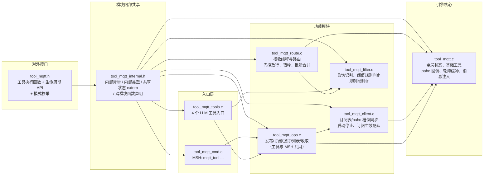
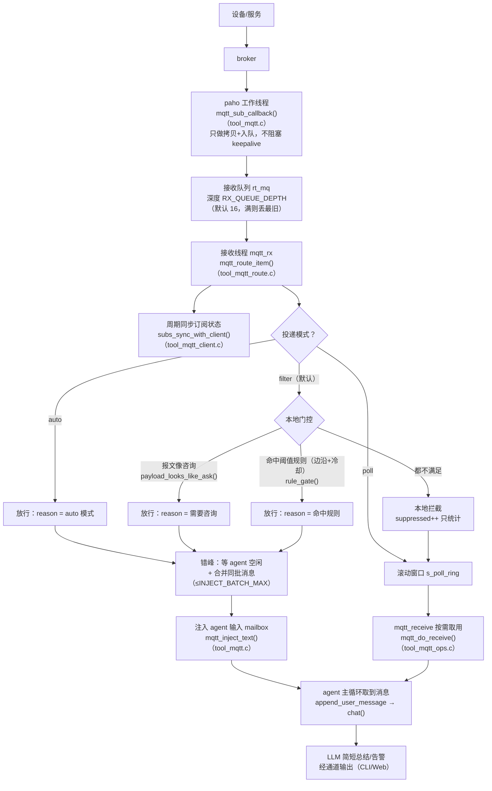
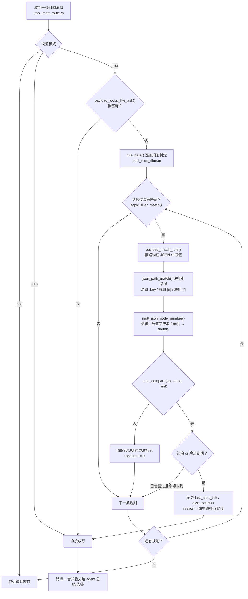
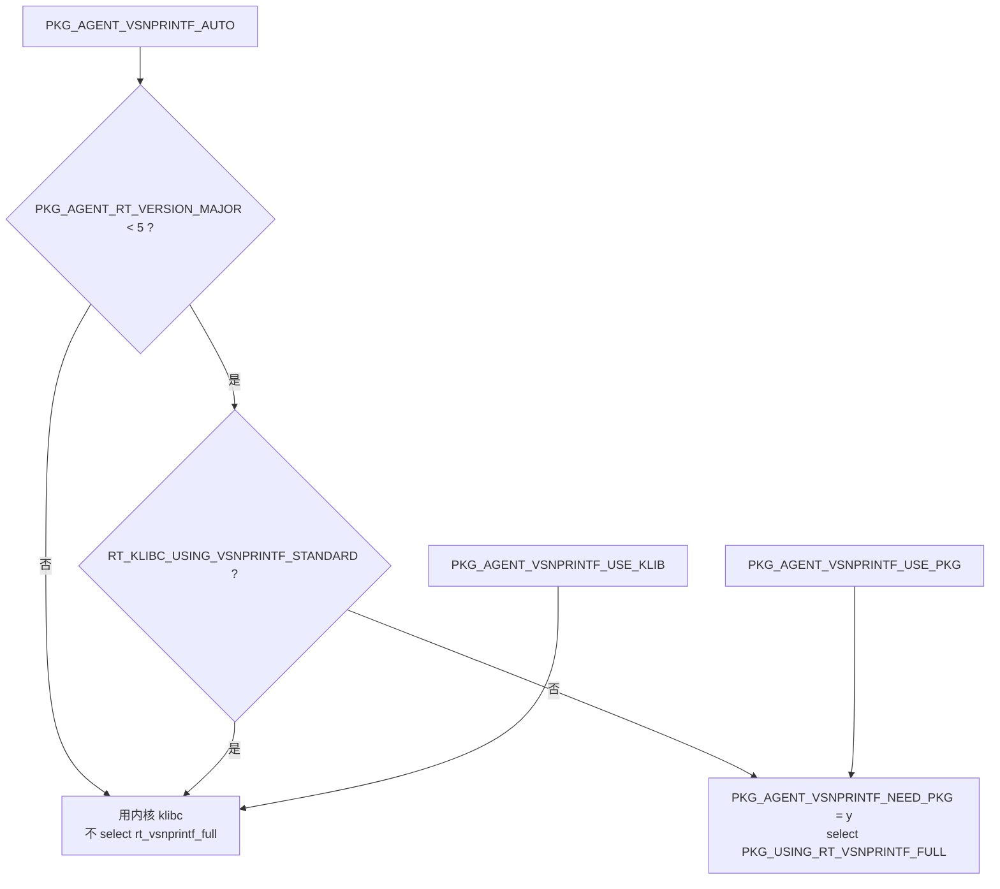

# MQTT 工具：话题命令下发与订阅消息分析

> 面向使用者的 MQTT 工具说明：agent 如何**向话题发布命令**，以及如何**订阅话题并把收到的消息交给 agent 分析**。
> 工具开发规范见 [tool_guide.md](./tool_guide.md)，框架结构见 [framework.md](./framework.md)，接口清单见 [api.md](./api.md)。

---

## 1. 能力概览

| 工具（LLM 可见名） | 作用 | 典型用户说法 |
|---|---|---|
| `mqtt_connect` | **连接 broker**（未启动则启动、未连上则等待）并报告连接状态 | "连上 MQTT"、"怎么发不出去了？检查一下连接" |
| `mqtt_disconnect` | **断开连接**并释放工作线程/接收线程/队列（订阅意图保留） | "先断开 MQTT"、"别占用网络了" |
| `mqtt_publish` | 向指定话题发布消息（下发命令），**发布前自动做连接检查** | "打开设备 1 的灯"、"给 agent/pub 发一条 hello" |
| `mqtt_subscribe` | 订阅 / 退订 / 查看话题（**支持运行时动态增删**），**订阅前自动做连接检查**，并选择投递模式（默认 `filter`） | "订阅 device/+/data"、"别再监听这个话题了" |
| `mqtt_rule` | 设置阈值规则：**只有越界才打扰 agent**（含冷却与边沿判定，支持嵌套路径） | "湿度超过 30 就告诉我"、"别每条都分析，异常再说" |
| `mqtt_history` | **汇总近期情况**：最近消息（含原始 payload）+ 数值字段 min/max/avg/last + 计数；只读不消费 | "最近湿度怎么样"、"帮我评估一下最近情况"、"给个趋势" |
| `mqtt_receive` | 取出并**消费**缓冲中的消息（取出即移除） | "把缓存的报文取出来" |

**连接检查（connect-first）**：`mqtt_publish` / `mqtt_subscribe` 执行前都会走同一套前置检查
`mqtt_tool_ensure_connected()`：

1. 客户端未启动 → 自动 `mqtt_tool_start()`（建接收队列/接收线程 + paho 工作线程）
2. 已启动但未连上 → 等待最多 `PKG_AGENT_TOOL_MQTT_CONNECT_WAIT_MS`（默认 3s）
3. 仍未连上 → 结果里明确写出 `broker / 等待时长 / state / 建议动作`，并且**不执行**发布

无论哪种情况，结果文本都会带上 `state=stopped|connecting|connected`，模型据此判断当前状态；
订阅场景即使未连上也不会失败——订阅意图会登记，连上后自动生效（结果里显示 `pending`）。

**默认行为（filter 模式）**：订阅到的话题**不会**每条都触发 LLM。只有满足下面任一条时才把消息交给 agent 做**简短总结或告警**：

1. **需要咨询**：报文里出现问句/求助/异常类关键词（`?`、help、advice、alert、error、异常、故障、请问…）
2. **超过阈值**：命中 `mqtt_rule` 设置的数值规则（由「未越界 → 越界」的边沿触发，且有冷却时间）

其余例行数据在本地过滤掉：**原始 payload 会进「近期历史环形缓冲」**（每话题保留最近 N 条），
需要时用 `mqtt_history` 读取并总结——既不消耗 LLM 调用，也不丢数据、且读取不影响后续读取。

| 投递模式 | 行为 |
|---|---|
| `filter`（默认） | 只有「咨询」或「命中阈值规则」才交给 agent |
| `auto` | 该话题每条消息都交给 agent（旧行为，适合命令/事件类话题） |
| `poll` | 都不自动交给 agent，全部由 `mqtt_receive` / `mqtt_history` 取用 |

另有 MSH 调试命令 `mqtt_tool`（见 §7），可在不经过大模型的情况下验证整条链路。

---

## 2. 模块划分

`tool_mqtt.c` 原本是单文件（2500+ 行），现已拆为「1 个对外头 + 1 个内部头 + 7 个源文件」，
每个文件职责单一、只通过 `tool_mqtt_internal.h` 交换状态与函数声明：



| 文件 | 行数级 | 职责 |
|---|---|---|
| `tool_mqtt.h` | ~270 | 对外接口：`tool_mqtt_*` 工具函数、`mqtt_tool_start/stop`、投递模式枚举、可调宏 |
| `tool_mqtt_internal.h` | ~210 | 内部常量（缓冲/超时/原因长度）、内部类型、共享状态 `extern`、跨模块函数声明 |
| `tool_mqtt.c` | ~520 | 引擎核心：全局状态、加解锁与话题匹配等基础工具、paho 回调、轮询缓冲、消息注入 |
| `tool_mqtt_client.c` | ~460 | 订阅表与 paho 槽位同步、客户端/接收线程生命周期、订阅生效确认 |
| `tool_mqtt_route.c` | ~300 | 接收线程主循环、消息路由、门控放行、错峰与批量合并 |
| `tool_mqtt_filter.c` | ~370 | 本地过滤（咨询识别）与阈值规则（数值提取、比较、边沿+冷却、规则管理） |
| `tool_mqtt_ops.c` | ~400 | 业务操作：发布/订阅/退订/列表/收取（不含 LLM 封装与命令行解析） |
| `tool_mqtt_tools.c` | ~320 | LLM 工具入口：参数解析 → 业务操作 → 结果回填工具节点 |
| `tool_mqtt_cmd.c` | ~245 | MSH 调试命令与报文模拟 |

> 构建：`SConscript` 在 `PKG_AGENT_TOOL_MQTT_ENABLE` 打开时自动遍历该目录下所有 `.c`，新增文件无需改构建脚本。

---

## 3. 数据流

### 3.1 下发命令（agent → 话题）

```mermaid
flowchart TD
    U["用户：给 device/1/cmd 发一条 {\"led\":1}"] --> L["LLM 返回 tool_call<br/>mqtt_publish(topic, message)"]
    L --> T["tool_mqtt_publish()<br/>（tool_mqtt_tools.c）"]
    T --> V{"参数与长度校验<br/>message 必填、受 buf/pipe 限制"}
    V -- 不合法 --> E["结果文本回填 role=tool<br/>error: ... → LLM 看到失败原因"]
    V -- 合法 --> S["mqtt_do_publish()<br/>（tool_mqtt_ops.c）"]
    S --> LS{"客户端已启动？"}
    LS -- 否 --> ST["mqtt_tool_start()<br/>（tool_mqtt_client.c）"]
    LS -- 是 --> W
    ST --> W{"等待连接<br/>默认 3s"}
    W -- 超时 --> E
    W -- 已连接 --> P["paho_mqtt_publish()<br/>→ rt_pipe → paho 工作线程 → broker"]
    P --> R["publish ok: topic=... bytes=...<br/>回填 role=tool → LLM 继续回答"]
```

### 3.2 订阅消息分析（话题 → agent）



> 说明：agent 未运行时被放行的消息同样进入滚动窗口（日志 `buffer mqtt message from ...`），不丢消息。

注入给 LLM 的消息文本（可用 `PKG_AGENT_TOOL_MQTT_INJECT_FMT` 覆盖）：

```
[MQTT message forwarded for analysis]
topic: agent/sub
payload: {"dev":"s1","hum":35}
forward reason: threshold rule matched: hum=35 > 30
Reply with a short summary or alert for the user. Keep it brief and do not restate routine data.
```

`forward reason` 明确告诉模型「为什么这条消息被放行」（咨询类 / auto 模式 / 命中哪条阈值规则），并要求**简短总结**，避免长篇复述例行数据。

---

## 4. 工具参数（LLM 视角）

### 4.1 `mqtt_publish`

```json
{
  "name": "mqtt_publish",
  "parameters": {
    "type": "object",
    "properties": {
      "topic":   { "type": "string", "description": "目标话题，省略则用默认发布话题 agent/pub" },
      "message": { "type": "string", "description": "消息内容（纯文本或 JSON 字符串）" }
    },
    "required": ["message"]
  }
}
```

结果示例：`publish ok: topic=agent/pub bytes=11 qos=1`

### 4.2 `mqtt_subscribe`

```json
{
  "name": "mqtt_subscribe",
  "parameters": {
    "type": "object",
    "properties": {
      "action": { "type": "string", "description": "subscribe（默认）| unsubscribe | list" },
      "topic":  { "type": "string", "description": "话题过滤器，支持 + 与 # 通配" },
      "mode":   { "type": "string", "description": "auto（默认，自动分析）| poll（手动收取）" }
    },
    "required": ["action"]
  }
}
```

结果示例：

```
subscribe ok: topic=agent/sub mode=filter
mode=filter (default): messages are NOT sent to you unless they look like a question or match a
threshold rule; set one with mqtt_rule. Use mode=auto to forward every message, or mode=poll to
only buffer them.
```

```
client: started=1 connected=1 broker=tcp://... client_id=rt-thread-agent
default topics: pub=agent/pub sub=agent/sub qos=1
[0] topic=agent/sub want=1 mode=filter registered=1 subscribed=1 rx=9 injected=3 suppressed=6
    last payload: {"dev":"s1","hum":41}
rules (forward only when matched):
[0] topic=agent/sub hum (json field) > 30 triggered_now=1 alert_count=2
summary: active=1/4 rx_total=9 injected_total=3 suppressed_total=6 alerts=2 dropped=0 buffered=2 overwritten=3
```

> `status`/`list` 同时可用于**按需总结**：`last payload` 给出最新读数，`suppressed` 给出被本地过滤的条数。

### 4.3 `mqtt_rule`

```json
{
  "name": "mqtt_rule",
  "parameters": {
    "type": "object",
    "properties": {
      "action": { "type": "string", "description": "set（默认）| clear | list" },
      "topic":  { "type": "string", "description": "规则适用的话题过滤器（clear 时 '*' 清空全部）" },
      "field":  { "type": "string", "description": "要比较的 JSON 字段名，如 hum；省略则整条 payload 当数值" },
      "op":     { "type": "string", "description": "> >= < <= == !=，默认 >" },
      "value":  { "type": "double", "description": "阈值，如 30" }
    },
    "required": ["action"]
  }
}
```

结果示例：

```
rule set: topic=agent/sub value=hum > 30 (cooldown 60000 ms)
you will only be notified when this condition becomes true (or after the cooldown)
```

行为要点：

- **边沿触发**：由「未越界 → 越界」时告警一次；持续越界期间不重复打扰
- **冷却**：距上次告警超过 `PKG_AGENT_TOOL_MQTT_ALERT_COOLDOWN_MS`（默认 60s）后，持续越界也会再次提醒
- **回落复位**：数值回到阈值内即清除边沿标记，下次越界可再次告警
- 报文里取不到该路径（非 JSON / 无此路径 / 非数值）时该规则不参与判定
- 一条规则最多 4 条（`PKG_AGENT_TOOL_MQTT_MAX_RULES`），同一 `话题+路径+比较符` 重复设置视为更新阈值
- **多条规则之间是「或」**：任一条命中即交给 agent（日志/`forward reason` 会写明是哪条命中）

#### 4.3.1 判定流程



#### 4.3.2 复合（嵌套）数据的取值写法

`field` 支持 **JSON 路径**，不再是只能取顶层字段：

| payload 示例 | `field` 写法 | 说明 |
|---|---|---|
| `{"hum":35}` | `hum` | 顶层字段（最常用） |
| `{"sensor":{"hum":35}}` | `sensor.hum` | 嵌套对象，`.` 逐层深入 |
| `{"sensor":{"a":{"hum":35}}}` | `sensor.a.hum` | 多层嵌套，可继续加 `.` |
| `{"readings":[{"t":10},{"t":45}]}` | `readings[1].t` | 数组下标（从 0 开始） |
| `{"readings":[{"t":10},{"t":45}]}` | `readings[*].t` | **任一元素命中即算命中**（45 > 40 ✔） |
| `{"readings":[20,22,45]}` | `readings` | 字段本身是数组时同样按「任一元素命中」 |
| `{"hum":"35"}` | `hum` | **数值字符串**也按数值处理（设备常见写法） |
| `{"alarm":true}` | `alarm` | 布尔按 1/0 处理 |
| `35` | 省略 `field` | 整条 payload 就是数值 |
| `{"a":1,"b":2}` | 省略 `field` | 取不到数值 → 该规则不参与判定 |

对话/命令行示例：

```
用户："设备上报的是 sensor.hum，超过 30 提醒我"
→ mqtt_rule(action=set, topic="agent/sub", field="sensor.hum", op=">", value=30)
   rule set: topic=agent/sub path=sensor.hum > 30 (cooldown 60000 ms)

msh /> mqtt_tool rule agent/sub readings[*].temp > 50      # 数组内任一温度超 50 就告警
msh /> mqtt_tool rules                                     # 查看规则（显示 json path）
[2] topic=agent/sub devices[*].temp (json path) > 50 triggered_now=0 alert_count=1
```

**关于「复合条件」（同时满足两个条件才告警）**：当前设计里多条规则是「或」关系；如果需要
`temp>30 且 hum>80` 这类「与」关系，有两种做法：

1. 让设备/网关上报一个组合后的字段（例如 `{"alarm":1}`），规则只看该字段（推荐，最省资源）
2. 需要工具原生支持时，可以给规则再加一组可选条件（`field2/op2/value2`，语义为 AND）——按需告知即可加上

### 4.4 `mqtt_receive`

| 参数 | 类型 | 说明 |
|---|---|---|
| `max` | number | 最多取出条数（默认/上限为缓冲深度 8） |
| `topic` | string | 只取该话题的消息，支持通配 |

结果示例：

```
[0] topic: device/1/data
payload: {"temp":25}
[1] topic: device/2/data
payload: {"temp":31}
buffered=0 rx_total=3 injected=0 dropped=0
total 2 message(s) fetched
```

### 4.5 `mqtt_history`

只读汇总接口，用于回答「最近情况如何 / 帮我评估一下 / 给我个趋势」：

| 参数 | 类型 | 说明 |
|---|---|---|
| `topic` | string | 要汇总的话题过滤器（支持通配）；省略则汇总全部已订阅话题 |
| `max` | number | 每个话题最多列出多少条最近消息（默认/上限为 `HISTORY_DEPTH`，默认 8） |

结果示例（**含原始 payload、时间、数值统计与计数**）：

```
[topic=agent/sub] mode=filter want=1 received=5 forwarded=0 filtered=5 history=5
  recent messages (oldest -> newest):
    1) 8s ago: {"hum":41}
    2) 6s ago: {"hum":44}
    3) 4s ago: {"hum":38}
    4) 2s ago: {"hum":47}
  numeric summary:
    hum: n=4 min=38 max=47 avg=42.5 last=47

counters: rx_total=5 forwarded=0 filtered=5 alerts=0
note: this view is read-only; use mqtt_receive to consume buffered messages
Summarize the trend above and give the user a short assessment of the recent situation...
```

要点：

- **filter 模式下被本地拦截的例行数据也能被读到**：它们从未交给 LLM，但仍完整保留在每话题的历史环形缓冲里（含 payload），这正是「按需总结」的数据来源
- **只读、不消费**：反复调用结果一致（`mqtt_receive` 才会移除缓冲）
- 数值统计对**对象型 payload 的每个数值字段**分别统计（`min/max/avg/last/n`）；整条 payload 为数值时按 `payload` 统计；非 JSON 报文只列出原文
- 结果尾部附一句提示，引导模型给出「趋势 + 是否需要关注」的简短评估

---

## 5. 配置项

### 5.1 menuconfig（`PKG_AGENT_TOOL_MQTT_*`，已存在）

`menuconfig` 里的 MQTT 开关分成 5 个子 menu：`MQTT Connection` / `MQTT Topics & Delivery` / `MQTT Capacity & Buffers` / `MQTT Throttling & Alerts` / `MQTT Timeouts & Thread`，下列宏全部带 `range` 约束（填了越界值会回落到默认值，不会生成非法配置）。

| 配置 | 含义 | 当前值 |
|---|---|---|
| `PKG_AGENT_TOOL_MQTT_ENABLE` | 启用 MQTT 工具（不启用则 `src/tools/tool_mqtt/*.c` 不参与编译）；help 里列全 7 个工具与 3 条依赖要求 | y |
| `PKG_AGENT_TOOL_MQTT_BROKER_URL` | broker 地址（`tcp://host:port`，TLS 用 `ssl://`） | `tcp://47.93.225.100:1883` |
| `PKG_AGENT_TOOL_MQTT_CLIENT_ID` | 客户端 ID（多设备共用一个 ID 会互相顶掉会话） | `rt-thread-agent` |
| `PKG_AGENT_TOOL_MQTT_USERNAME` / `_PASSWORD` | 认证信息 | `USER1` / `USER1` |
| `PKG_AGENT_TOOL_MQTT_PUB_TOPIC` | 默认发布话题（也是遗嘱话题） | `agent/pub` |
| `PKG_AGENT_TOOL_MQTT_SUB_TOPIC` | 默认订阅话题（启动时自动订阅，模式见 `DEFAULT_MODE`） | `agent/sub` |
| `PKG_AGENT_TOOL_MQTT_WILLMSG` | 遗嘱消息内容 | `Goodbye from RT-Thread Agent` |
| `PKG_AGENT_TOOL_MQTT_BUF_SIZE` | paho 收发缓冲 | 1024 |
| `PKG_AGENT_TOOL_MQTT_DEFAULT_MODE_*` | 三选一的默认投递模式（`FILTER`/`AUTO`/`POLL`） | `FILTER` |
| `PKG_AGENT_TOOL_MQTT_QOS` | 仅为兼容旧 `.config` 保留；paho pipe 模式只支持 QoS1，工具固定用 QoS1，**该选项无效** | 1 |

### 5.2 工具内部参数（可在 `rtconfig.h` 中覆盖，缺省值已兜底）

| 宏 | 默认 | 含义 |
|---|---|---|
| `PKG_AGENT_TOOL_MQTT_MAX_SUB_TOPICS` | 4 | 同时订阅上限，自动收敛到 paho 的 `MAX_MESSAGE_HANDLERS` |
| `PKG_AGENT_TOOL_MQTT_MAX_RULES` | 4 | 阈值规则条数上限 |
| `PKG_AGENT_TOOL_MQTT_FIELD_MAX_LEN` | 24 | 规则中 JSON 字段名长度上限 |
| `PKG_AGENT_TOOL_MQTT_ALERT_COOLDOWN_MS` | 60000 | 同一规则持续越界时的告警冷却时间 |
| `PKG_AGENT_TOOL_MQTT_DEFAULT_MODE` | `"filter"` | 默认订阅话题的投递模式（filter/auto/poll） |
| `PKG_AGENT_TOOL_MQTT_LAST_PAYLOAD_LEN` | 96 | 订阅记录缓存的"最近一条 payload"长度（供 status 查看） |
| `PKG_AGENT_TOOL_MQTT_HISTORY_DEPTH` | 8 | **每话题保留的近期消息条数**（`mqtt_history` 的数据源） |
| `PKG_AGENT_TOOL_MQTT_HISTORY_PAYLOAD_LEN` | 128 | 近期历史中单条 payload 的保存长度 |
| `PKG_AGENT_TOOL_MQTT_TOPIC_MAX_LEN` | 64 | 话题字符串缓冲长度 |
| `PKG_AGENT_TOOL_MQTT_PAYLOAD_MAX_LEN` | 256 | 单条接收 payload 上限（超出截断并标记） |
| `PKG_AGENT_TOOL_MQTT_MAX_PUB_LEN` | 256 | 单次发布 payload 上限 |
| `PKG_AGENT_TOOL_MQTT_RX_QUEUE_DEPTH` | 16 | 回调 → 接收线程队列深度（agent 忙时消息在此排队） |
| `PKG_AGENT_TOOL_MQTT_POLL_DEPTH` | 8 | poll 模式环形缓冲深度 |
| `PKG_AGENT_TOOL_MQTT_INJECT_MIN_INTERVAL_MS` | 1000 | 两次注入 agent 的最小间隔（防止请求过密被对端重置） |
| `PKG_AGENT_TOOL_MQTT_INJECT_BATCH_MAX` | 5 | 单次注入最多合并的消息条数 |
| `PKG_AGENT_TOOL_MQTT_BUSY_WAIT_MS` | 180000 | agent 忙时最多等待其空闲多久再投递，超时转 poll 缓冲 |
| `PKG_AGENT_TOOL_MQTT_CONNECT_WAIT_MS` | 3000 | 发布前等待连接超时 |
| `PKG_AGENT_TOOL_MQTT_SUB_WAIT_MS` | 3000 | 订阅生效确认超时 |
| `PKG_AGENT_TOOL_MQTT_KEEPALIVE_SEC` | 60 | keepalive 间隔 |
| `PKG_AGENT_TOOL_MQTT_RX_THREAD_STACK` / `_PRIO` | 3072 / 15 | 接收线程栈与优先级 |
| `PKG_AGENT_TOOL_MQTT_AUTO_SUB_DEFAULT` | 1 | 启动时自动订阅默认 SUB_TOPIC |
| `PKG_AGENT_TOOL_MQTT_PIPE_BUF_SIZE` | `RT_USING_POSIX_PIPE_SIZE` | paho pipe 缓冲（默认 512），发布长度上限参考 |
| `PKG_AGENT_TOOL_MQTT_INJECT_FMT` | 见 §3.2 | 注入给 LLM 的消息模板 |

### 5.3 依赖的 paho 配置

```c
#define PKG_PAHOMQTT_SUBSCRIBE_HANDLERS  4      /* 由 CONFIG_PKG_PAHOMQTT_SUBSCRIBE_HANDLERS 生成 */
#define RT_PKG_MQTT_THREAD_STACK_SIZE    8192   /* 由 CONFIG_RT_PKG_MQTT_THREAD_STACK_SIZE 生成 */
```

| 配置 | 说明 |
|---|---|
| `PKG_PAHOMQTT_SUBSCRIBE_HANDLERS` | paho(pipe 模式) 的订阅槽位数：**默认值 1 时只能订阅 1 个话题**，本项目已调整为 4（与 `PKG_AGENT_TOOL_MQTT_MAX_SUB_TOPICS` 匹配）。若改回 1，工具会自动把订阅上限收敛为 1，超出部分返回错误提示。 |
| `RT_PKG_MQTT_THREAD_STACK_SIZE` | paho 工作线程栈：**必须 ≥ 8192**。paho 启动时会 `open("/dev/MQTTn")` 创建发布管道，该路径走 DFS（`dfs_file_realpath` 会 `rt_malloc(DFS_PATH_MAX*3+3)`，DFS_PATH_MAX=4096 时即 12KB）。4KB 栈在线程内调用 DFS 时会栈溢出，溢出会踩坏堆内存（线程栈本身分配在堆上），表现为 `mqtt_tool start` 后系统卡死（详见 §9）。 |

### 5.4 `rt_vsnprintf` 与 RT-Thread 版本判断（Kconfig）

Agent 的 JSON 拼装和数值工具大量使用 `rt_snprintf`（含 `%f`、`%g`，见 `tool_add.c`/`tool_compare.c`/`tool_mul.c`/`tool_mqtt_filter.c`），
需要**支持浮点的完整 vsnprintf**：

| 内核 | klibc 情况 | 处理 |
|---|---|---|
| RT-Thread 5.x | `RT_KLIBC_USING_VSNPRINTF_STANDARD=y`，内核自带完整实现（`rt_vsnprintf_std.c`） | **不要**再启用 `rt_vsnprintf_full` 包，否则链接期 `multiple definition of 'rt_vsnprintf'` |
| RT-Thread 4.x 及更早 | 只有 tiny 实现（不支持 `%f`，格式化结果为空串） | 需要 `rt_vsnprintf_full` 包补齐 |

因此 Kconfig 里的 `select PKG_USING_RT_VSNPRINTF_FULL` 做成**条件化**的（文件见 `resource/kconfig_check/Agent.Kconfig`）：

```
config PKG_AGENT_RT_VERSION_MAJOR            int   "RT-Thread major version" (range 4 9, default 5)
choice PKG_AGENT_VSNPRINTF_SRC               AUTO / USE_KLIB / USE_PKG
config PKG_AGENT_KLIBC_HAS_VSNPRINTF         hidden: y if RT_KLIBC_USING_VSNPRINTF_STANDARD
config PKG_AGENT_VSNPRINTF_NEED_PKG          hidden: y if USE_PKG, or AUTO && major<5 && !klibc
config PKG_AGENT_SELECT_RT_VSNPRINTF_FULL    hidden: default y if NEED_PKG -> select PKG_USING_RT_VSNPRINTF_FULL
```

判定树（`Auto` 模式）：



验证脚本（只需 Python + `kconfiglib`，无需编译）：

```bash
python packages/Agent-latest/resource/kconfig_check/validate.py   # 判定逻辑 + 默认值 + 符号齐全性
python packages/Agent-latest/resource/kconfig_check/compat.py     # 现有 .config 的每个 PKG_AGENT_* 取值是否被保留
```

---

## 6. 运行时行为与边界

| 行为 | 说明 |
|---|---|
| 懒启动 | 首次 `mqtt_publish` / `mqtt_subscribe` 自动 `mqtt_tool_start()`，无需手工启动 |
| 自动重连 | 由 paho 工作线程负责（间隔 5s）；重连后 paho 会自动重订阅已注册的话题 |
| 订阅生效 | 已连接时立即发送 SUBSCRIBE；未连接时先登记，连上后由接收线程补订阅（工具返回 `pending`） |
| 去重 | 重叠过滤器（如 `a/#` 与 `a/b`）会让 paho 对同一报文回调多次，回调内按 `话题+报文ID+内容` 去重 |
| 限速与合并 | auto 模式下两次注入间隔不小于 `INJECT_MIN_INTERVAL_MS`（默认 1s），一次注入最多合并 `INJECT_BATCH_MAX`（默认 5）条；同一批内 topic+payload 完全相同的重复报文只报 1 条并注明条数 |
| 忙时错峰 | agent 正在处理上一轮对话（LLM 请求 + 工具执行）时，接收线程会等待其空闲再投递（最长 `BUSY_WAIT_MS`），期间消息留在队列里、空闲后合并成一次请求；日志 `agent busy, hold mqtt message ...` 可见 |
| 本地门控 | `filter` 模式下由接收线程判定「是否值得打扰 agent」：命中咨询关键词或阈值规则才放行；其余只累加 `suppressed` 计数并进滚动窗口。门控在「agent 是否运行」判断之前执行，因此 agent 未运行时也能统计 |
| 阈值告警语义 | 边沿触发 + 冷却：越界首次告警、持续越界不重复、回落复位、冷却到期可再告警；原因写进注入文本的 `forward reason` 字段 |
| 按需总结 | 例行数据不丢：每话题保留最近 `HISTORY_DEPTH`(默认 8) 条原始报文，`mqtt_history` **只读**汇总「最近消息 + 数值 min/max/avg/last + 收发计数」，`mqtt_receive` 则取出并消费缓冲；`mqtt_tool status` 另给出每话题 `last payload`、`suppressed` 计数与规则状态 |
| 动态增删订阅 | 运行期可随时增删话题（LLM 工具 `mqtt_subscribe` / MSH `mqtt_tool sub|unsub` / 应用层 API `mqtt_tool_add_topic`、`mqtt_tool_remove_topic`）：已连接时立即发 SUBSCRIBE/UNSUBSCRIBE，未连接时先登记、连接后自动订阅；删除后 paho 槽位被释放并可被后续订阅复用 |
| 请求失败重试 | `agent_loop` 对失败请求自动重试 3 次（间隔 1s/2s），因此 TLS 抖动（`mbedtls NET_RECV_FAILED`）不再直接丢弃整轮对话；已流式输出的部分内容在重试时可能重复打印 |
| agent 未运行 | 收到的消息不注入，改存 poll 缓冲（日志 `agent not running, buffer mqtt message`），agent 启动后可用 `mqtt_receive` 取回 |
| 输入 mailbox 满 | 注入失败时消息回落到 poll 缓冲，不会泄漏内存（`AgentLoop` 对 `put_message` 失败也会自行释放） |
| 长度限制 | 发布长度 = `min(MAX_PUB_LEN, buf_size, pipe_buf) - sizeof(MQTTMessage) - topic - 1`，超出直接返回错误而不截断 |
| QoS | paho(pipe) 仅支持 QoS1，工具统一使用 QoS1，不跟随 `PKG_AGENT_TOOL_MQTT_QOS` |
| 内存 | 客户端缓冲 2×`BUF_SIZE`、队列/缓冲/批量暂存约 4KB（全部堆分配） |

**已知限制**

1. paho 的 `paho_mqtt_unsubscribe` 按“前缀匹配”释放槽位：同时存在 `a/#` 与 `a/b` 这类互相重叠的过滤器时，首次退订可能释放到另一个槽位。本工具在每次订阅/退订后都会以 paho 实际槽位为准重新同步状态，并在后续周期自动补齐，最终状态一致（可能有一两个同步周期延迟）。
2. 未连接状态下 `mqtt_tool stop` 无法让 paho 工作线程退出（paho pipe 模式只提供 pipe 命令退出），此时该线程会继续后台重连；因此 `cleanup_agent` **不会**停止 MQTT 客户端，订阅关系与连接可跨 agent 重启保持。

---

## 7. MSH 调试命令

```
mqtt_tool connect [timeout_ms]           # 连接（未启动则启动 + 等待连接，默认等 3s）
mqtt_tool disconnect                     # 断开并释放工作线程/接收线程/队列（订阅保留）
mqtt_tool start | stop                   # connect / disconnect 的别名（兼容旧用法）
mqtt_tool status                         # 连接状态 + 订阅表（含 suppressed/last payload）+ 规则表
mqtt_tool sub <topic> [filter|auto|poll] # 订阅话题（默认 filter；执行前先做连接检查）
mqtt_tool unsub [topic]                  # 退订（省略话题=全部退订）
mqtt_tool pub [topic] <message>          # 发布（执行前先做连接检查）
mqtt_tool rule <topic> [field] <op> <n>  # 设阈值规则，如 rule agent/sub hum > 30
mqtt_tool rule del [topic]               # 删规则（省略话题=全部）
mqtt_tool rules                          # 查看订阅与规则（等同 status）
mqtt_tool recv [max] [topic]             # 取出缓冲/滚动窗口里的消息（取出即消费）
mqtt_tool history [topic] [max]          # 近期汇总：最近消息(含 payload) + 数值统计（只读）
mqtt_tool sim <topic> <payload>          # 模拟一条订阅消息（不需要 broker）
mqtt_tool flush                          # 丢弃缓冲
```

**连接/断开与自动重连**

```
msh /> mqtt_tool disconnect              # 未启动时：client already stopped, nothing to do
msh /> mqtt_tool pub agent/pub hello     # 未连接时：自动启动+等待连接，然后 publish ok (state=connected)
msh /> mqtt_tool sub device/1/data poll  # 订阅前同样做连接检查
msh /> mqtt_tool disconnect              # disconnect ok: was_connected=1, state=stopped
                                         # 2 subscription(s) kept - 下次 connect 后自动重新订阅
msh /> mqtt_tool connect                 # Subscribe #0 agent/sub OK! / Subscribe #1 device/1/data OK!
```

> MSH 输出按行分段打印（`rt_kprintf` 内部缓冲为 `RT_CONSOLEBUF_SIZE`，默认 256 字节，
> 一次性打印长文本会被静默截断）。

**动态增删订阅（运行期，可反复执行）**

```
msh /> mqtt_tool sub device/1/data poll     # 新增订阅（立即订阅成功）
msh /> mqtt_tool sub device/+/temp filter   # 再新增一个（通配话题）
msh /> mqtt_tool status                     # 查看当前订阅表（含槽位注册/生效状态）
msh /> mqtt_tool unsub device/+/temp        # 删除（真实发出 UNSUBSCRIBE 并释放槽位）
msh /> mqtt_tool sub device/2/data poll     # 槽位被复用
```

**验证门控（无需大模型 / 无需 broker）**

```
msh /> mqtt_tool start
msh /> mqtt_tool sub agent/sub filter
msh /> mqtt_tool pub agent/sub {"hum":20}      # 例行数据：不进 agent
msh /> mqtt_tool rule agent/sub hum > 30
msh /> mqtt_tool pub agent/sub {"hum":35}      # 越界：放行（日志 buffer mqtt message / mqtt -> agent）
msh /> mqtt_tool pub agent/sub {"hum":36}      # 持续越界：冷却内不再打扰
msh /> mqtt_tool status
```
（`sim` 也会走同一门控路径，可用它替代 `pub` 验证。）

**验证链路（无需大模型 / 无需 broker）**

```
msh /> mqtt_tool start
msh /> mqtt_tool sub device/+/data poll
msh /> mqtt_tool sim device/1/data {"temp":25}
msh /> mqtt_tool recv
[0] topic: device/1/data
payload: {"temp":25}
```

`mqtt_tool sim` 直接走“订阅回调 → 队列 → 接收线程 → 路由”链路，可用来验证通配匹配、模式与缓冲逻辑。

**验证完整分析链路**：`mqtt_tool sub agent/sub auto` → 用任意 MQTT 客户端向 `agent/sub` 发一条消息（或在 MSH 中先 `pub` 再 `recv` 观察回环）→ agent 运行中时日志出现 `mqtt -> agent: 1 message(s) delivered for analysis`，随后输出 LLM 的分析结论。

---

## 8. 与框架的对接

| 位置 | 改动 |
|---|---|
| `include/AgentRuntime.h`（新增） | `agent_get_message_hub()` / `agent_is_running()` / `agent_is_busy()`：供工具层注入消息并做错峰 |
| `src/AgentLoop.c` | 实现上述访问器；`cleanup_agent` 先摘除 hub 全局引用再销毁（避免注入方访问已释放对象）；输出 mailbox 满时释放消息（避免泄漏）；请求失败自动重试 3 次 |
| `include/tools/tools.h` | `#ifdef PKG_AGENT_TOOL_MQTT_ENABLE` 下包含 `tool_mqtt.h` |
| `src/tool_func.c` | 注册 `mqtt_connect` / `mqtt_disconnect` / `mqtt_publish` / `mqtt_subscribe` / `mqtt_rule` / `mqtt_history` / `mqtt_receive` 七个工具 |
| `SConscript` | 启用宏后遍历 `src/tools/tool_mqtt/*.c` 编译，并加入 `include/tools/tool_mqtt` 头文件路径 |

### 8.1 应用层动态增删订阅（公开 API）

工具内部按「订阅表 + paho 槽位」管理所有订阅，运行期可随时增删，**不需要重启客户端或重连 broker**：

| 函数（`include/tools/tool_mqtt/tool_mqtt.h`） | 说明 |
|---|---|
| `rt_err_t mqtt_tool_add_topic(const char *topic, mqtt_deliver_mode_t mode)` | 新增/更新订阅；客户端未启动会自动启动，未连接时先登记、连上自动订阅 |
| `rt_err_t mqtt_tool_remove_topic(const char *topic)` | 删除订阅（异步：接收线程 ≤200ms 内发出 UNSUBSCRIBE 并释放槽位） |
| `int mqtt_tool_topic_count(void)` | 当前有效订阅数 |
| `const char *mqtt_tool_conn_state(void)` | 连接状态字符串：`stopped` / `connecting` / `connected`，应用层可据此做界面指示 |
| `rt_bool_t mqtt_tool_ensure_connected(char *out, rt_size_t out_size)` | 连接前置检查（发/订前调用）：未启动则自动启动、未连上则等待超时；返回 `RT_FALSE` 时 `out` 内是可直接回显的原因文本 |

```c
/* 设备上线后动态关注它自己的话题，离线时移除 */
mqtt_tool_add_topic("device/7/data", MQTT_DELIVER_FILTER);
...
mqtt_tool_remove_topic("device/7/data");
```

同一个能力也开放给 LLM（`mqtt_subscribe` 工具的 `action=subscribe/unsubscribe`）与 MSH（`mqtt_tool sub/unsub`）。
**关于「回调函数」**：所有话题共用同一个 paho 回调 `mqtt_sub_callback`（它只做拷贝+入队），
真正的分流由订阅表完成——按话题过滤器匹配后决定投递模式（filter/auto/poll）与是否命中阈值规则。
因此「动态增删订阅」不需要注册/注销 C 函数指针，增删话题即增删「回调行为」。

应用层自行调用发布/订阅 API 时，建议先做一次连接前置检查（工具内部也是这么做的），避免在未连接时拿到难以理解的错误：

```c
char err[128];

if (!mqtt_tool_ensure_connected(err, sizeof(err)))
{
    rt_kprintf("mqtt not ready: %s (state=%s)\n", err, mqtt_tool_conn_state());
}
else
{
    mqtt_tool_add_topic("device/7/data", MQTT_DELIVER_AUTO);
}
```

工具节点结果写入遵循框架约定（见 [tool_guide.md](./tool_guide.md) §6.3）：每次执行前释放旧 `ret.messages`，失败时把错误文本作为 `TYPE_TEXT` 结果返回，让模型看到失败原因。

---

## 9. 故障排查

| 现象 | 排查方向 |
|---|---|
| **模型反复调用 `mqtt_history`（十几轮不回复，像卡死）** | 三个原因都已修复，逐个对应：① 工具结果**曾经会被尾部提示语覆盖成空/只剩提示语**（`used` 没从实际内容长度续写，见 §9.3）；② 取锁失败的报错文本被覆盖后模型看不到原因；③ 框架侧没有重复调用保护。现在：工具结果永远非空且写清「为什么查不到 + 下一步 + 不要再重复调用」，框架侧对**参数完全相同**的重复调用直接跳过执行，连续两轮整轮重复就**强制生成文本回答**，达到轮次上限（6）也会强制收尾，保证这一轮一定有回复（见 §9.4） |
| `mqtt_tool status` / `mqtt_history` 在**启动前**报 `error: mqtt state busy, retry later` | 状态锁原先只在 `mqtt_tool_start()` 里创建，未启动客户端时只读操作全部失败。已改为幂等懒创建（`mqtt_tool_lock_init()`，`lock_take()` 里兜底），未启动也能读订阅表（见 §9.3） |
| 模型不调用 MQTT 工具 | 检查工具描述是否被裁剪；确认 `init_tools()` 已执行（MSH 执行 `init_tools`） |
| 串口日志出现 `Warning: There is not enough buffer to output the log, please increase the ULOG_LINE_BUF_SIZE option` | 工具结果变长后超过 ulog 行缓冲（只影响**日志**，不影响交给模型的工具结果）。本项目 `ULOG_LINE_BUF_SIZE` 已由 512 提到 1024 |
| `error: mqtt not connected` | 网络/域名解析不通、broker 地址或账号错误；看 `mqtt connecting/online/offline` 日志 |
| `error: payload too long` | 缩短消息，或调大 `BUF_SIZE` / `MAX_PUB_LEN` / pipe 缓冲 |
| 订阅返回 `pending` | 客户端尚未连上；连上后自动生效，可用 `mqtt_tool status` 观察 `subscribed=1` |
| 收到消息但 agent 无反应 | **先确认投递模式**：`filter`（默认）下例行数据本来就不会打扰 agent，这是设计行为——看 `mqtt_tool status` 的 `suppressed` 计数是否在增长；需要每条都分析就 `mode=auto`。此外确认 agent 正在运行（`main_loop_entry`）；日志出现 `agent busy, hold mqtt message` 属正常错峰，当前对话结束后会自动合并投递。**想让 agent 总结这些被过滤的数据，用 `mqtt_history`（只读，能看到原始 payload）** |
| `status`/`history` 等 MSH 输出被截断在 255 字节左右 | `rt_kprintf` 使用共享的 `rt_log_buf[RT_CONSOLEBUF_SIZE]`（默认 256），一次性打印超长文本会被静默截断。工具内部已改为按行分段打印；自己写 MSH 输出时同理需要分段 |
| 阈值告警没触发 | 检查：规则字段名与报文 JSON 字段是否一致（大小写敏感）、话题过滤器是否匹配、payload 是否为合法 JSON（`{hum:35}` 少了引号不是合法 JSON，规则不参与判定）；`status` 里 `triggered_now` 可看当前是否处于越界状态 |
| 想临时每条都看 | `mqtt_tool sub <topic> auto`（或让 agent 用 `mqtt_subscribe mode=auto`），验证完改回 `filter` |
| 消息被截断 | payload 超过 `PAYLOAD_MAX_LEN`（256），`mqtt_receive` 会标注 `(truncated)` |
| 只订阅成功 1 个话题 | `PKG_PAHOMQTT_SUBSCRIBE_HANDLERS` 被改回 1，改回 4 即可 |
| **`mbedtls_client_read data error, return -0x4c` → `chat: POST failed, http status=-76` → `Chat request failed, terminating this case`** | `-0x4c` = `MBEDTLS_ERR_NET_RECV_FAILED`，即 HTTPS/TLS 连接在读取响应时被对端或网络重置，与 MQTT 消息内容无关。常见诱因是**请求过于密集**（设备周期性上报 → 每条消息触发一次 LLM 请求，容易被服务端/代理限流重置）。已在两侧缓解：① 注入侧错峰 + 合并（default 1s 间隔、批量 5 条、agent 忙时等待空闲）；② 框架侧 `agent_loop` 失败自动重试 3 次。若仍频繁出现，可调大 `PKG_AGENT_TOOL_MQTT_INJECT_MIN_INTERVAL_MS`，或在设备侧降低上报频率/只上报变化量 |
| **`mqtt_tool start` 后整机卡死（shell 无响应）** | paho 工作线程栈不足：`RT_PKG_MQTT_THREAD_STACK_SIZE` 需 ≥ 8192。栈溢出会破坏堆元数据，导致后续 `rt_malloc` 在大块请求上死循环。已本项目中修复；排查方法见下 |
| 终端输入较长一句话后出现 `Function[_rt_mutex_take]: scheduler is not available` 断言（CLI 通道） | `CLI_THREAD_STACK_SIZE` 过小（原 1024）：CLI 线程栈上有 512 字节输入缓冲，且每敲一键都要经 `rt_kprintf` 重绘整行，长输入会栈溢出，溢出被内核栈检查捕获后又在调度器上下文中调用 ulog 进而断言。已调整为 4096（`include/channels/CLI.h`） |

### 9.1 卡死问题的定位过程（真实案例）

现象：`mqtt_tool start` 后终端失去响应，概率性复现；`list`/`msh` 全部无响应。

定位手段（QEMU + gdbstub，脚本见 `resource/mqtt_test/`）：

```bash
# 1) 启动 QEMU 时带 -s（gdbstub），串口走 tcp
qemu-system-arm -M vexpress-a9 -smp cpus=2 -kernel rtthread.bin -sd sd.bin \
    -display none -serial tcp:127.0.0.1:5580,server,nowait -s
# 2) 复现卡死后，用 gdb 读当前线程与调用栈
arm-none-eabi-gdb -batch -ex "target remote :1234" -ex "bt" rtthread.elf
```

gdb 给出的关键信息：

```
#0  rt_smem_alloc (m=0x6028f7f0, size=12296) at mem.c:308      ← 堆分配器死循环
#1  rt_malloc (size=12291)
#2  dfs_file_realpath (...) at dfs_file.c:405                   ← rt_malloc(DFS_PATH_MAX*3+3)
#3  dfs_file_open (... "/dev/MQTT0" ...)
#4  open ("/dev/MQTT0", flags=1)
#5  mqtt_pipe_init (...) at paho_mqtt_pipe.c:978                 ← paho 创建发布管道
#6  paho_mqtt_thread (...)                                      ← paho 工作线程（栈 4096）
```

结论与修复：把 `RT_PKG_MQTT_THREAD_STACK_SIZE` 从 4096 提到 **8192**，问题消失（`mqtt_tool start` 稳定连上 broker，shell 保持响应）。

对比验证：同样的 DFS 路径解析（`ls /`、`ls /dev`）在 4KB 栈的 MSH 线程里正常，只有 paho 工作线程会触发 —— 说明是**该线程栈溢出**而非 DFS 或 MQTT 逻辑问题。同类问题在启用 paho pipe 模式 + DFS v2 的工程中都会出现，建议保持 ≥ 8192。

### 9.2 相关连带修复

验证过程中还定位到三个与工具调用链路相邻的缺陷（都容易被误判成「工具坏了」）：

| 问题 | 现象 | 修复 |
|---|---|---|
| `PKG_AGENT_STREAM_LINE_BUFSZ` 仅 256 字节 | **模型不调用工具**：带 `tool_calls` 的 SSE 报文行实测 310+ 字节，超长整行被静默丢弃，框架认为模型没发起调用，直接把「我准备调用工具」的文本当成最终回答 | 该值提到 1024；同时改为「超长行告警并跳过」而非静默丢弃（`src/chat.c`） |
| 推理字段名不兼容 | 提供方返回 `reasoning_content`，而 `chat.c` 只认 `reasoning`，导致思考过程全丢（界面只剩空白回复） | 两个字段名都支持（`src/chat.c`） |
| 工具调用分片字段为 `null` | 流式后续分片形如 `{"index":0,"id":null,"type":null,"function":{"name":"","arguments":"..."}}`，原实现按「字段必须齐全」判断并直接取 `valuestring`，会漏拼接/踩空指针 | 分片容错：`index` 缺失按 0、`id`/`name` 取首个非空分片、`arguments` 分片拼接；最终统一归一化（缺失 `id` 用 `call_<index>` 兜底、空 `arguments` 用 `{}` 兜底），保证下游 `tool_call_id` 与参数始终有效 |
| CLI 通道线程栈 1024 字节 | 在 CLI 通道下输入较长的一句话后出现 `_rt_mutex_take: scheduler is not available` 断言 | `include/channels/CLI.h` 的 `CLI_THREAD_STACK_SIZE` 改为 4096 |
| lwIP `tcpip_thread` 栈 2048 字节 | 网络流量较大时内核栈检查告警/断言 | `RT_LWIP_TCPTHREAD_STACKSIZE` 提到 4096、`RT_LWIP_ETHTHREAD_STACKSIZE` 提到 2048 |

诊断技巧：
- 这类问题看串口日志里的 `backtrace:` 十六进制地址，用 `arm-none-eabi-addr2line -e rtthread.elf -a -f <地址...>` 还原调用栈，即可判断是内核/协议栈线程栈溢出还是本模块逻辑问题。
- 判断「模型到底有没有发起工具调用」最直接的办法是抓一次真实 SSE 报文（用同一个 API Key 直接请求），确认 `tool_calls` 分片的长度与字段形状，再对照 `chat.c` 的解析条件。

### 9.3 案例：问「agent/sub 的历史」导致模型死循环（真实案例）

现象：CLI 里问一句 “please tell me the history of agent/sub”，日志连续出现十几轮

```
Detected 1 tool invocation(s)
[Local Tool mqtt_history Execution Result] type text, result
Summarize the trend above and give the user a short assessment of the recent situation: ...
```

工具结果**只剩尾部提示语**、正文全没了，模型以为没拿到数据就换着参数（`max=8/10`…）不停重试，最终既不回答也不结束（达到原 `loop_max=10` 后直接 `break`，不发任何回答）。

三个独立缺陷叠加造成，已全部修复：

| # | 缺陷 | 说明 | 修复 |
|---|---|---|---|
| 1 | **工具结果被自己的提示语覆盖** | `tool_mqtt_history` / `tool_mqtt_receive` 里 `used` 初值为 0，而 `mqtt_do_*` 内部用的是**各自的局部** `used`，并不回传长度。于是 `buf_append(result, ..., &used, "…提示语…")` 从**偏移 0** 开始写，把刚生成的工具正文整段覆盖（提示语 133 字节，短正文会被完全吃掉） | 追加前先 `used = rt_strlen(result)`（`tool_mqtt_tools.c` 两处），并把「必须从实际长度续写」写进注释 |
| 2 | **只读查询在客户端启动前必然失败** | `s_lock` 只在 `mqtt_tool_start()` 里创建，未启动时 `lock_take()` 因 `s_lock == RT_NULL` 直接返回失败，`status`/`history`/`receive` 一律报 `error: mqtt state busy, retry later`——而这条错误文本又被缺陷 1 覆盖，模型连「为什么失败」都看不到 | 新增幂等 `mqtt_tool_lock_init()`（`tool_mqtt.c`），`lock_take()` 兜底调用；`mqtt_tool_start()` 改为调用它。未启动也能读订阅表/历史/计数 |
| 3 | **框架侧没有重复调用保护** | 模型可以无限重试同一个工具调用，且达到轮次上限时**不发任何回答**就结束（用户端表现为「卡死」） | `AgentLoop.c`：① 记录最近 6 次调用签名 `name|args`，**参数完全相同**的调用不再执行，改为回一条「结果不会变，请直接回答」；② 连续两轮整轮都是重复调用 → 强制收尾；③ `loop_max` 10 → 6；④ 收尾时**最后一次不带工具**询问模型逼出纯文本回答，失败则给明确提示文本，保证一定有回复 |

顺带修掉的相邻问题：

- `mqtt_history` 查不到话题时原来只说 `no matching subscription`，现在写明**话题名 + 原因（未订阅/未启动）+ 下一步动作 + 不要再重复调用**（`tool_mqtt_ops.c`）。
- **CLI 通道会丢弃输出 mailbox 的内容**（`channels/CLI.c` 的 `CLI_run` 收到消息后只 `rt_kprintf("\n")`），所以「请求失败」「工具循环超限」这类模型不会流式输出的兜底文本，在 CLI 下用户根本看不到。现在兜底文本同时走流式打印路径（`agent_notify()`：mailbox + `on_context`），正常回答仍只投 mailbox，避免重复打印。

复现/回归脚本：`resource/mqtt_test/qemu_chat_history_test.ps1`（启动 QEMU → **不启动 MQTT** → 直接问历史），修复前后对比：

| 指标 | 修复前 | 修复后 |
|---|---|---|
| 工具调用轮数 | 10+（直到轮次上限） | **1** |
| 工具结果 | 只剩 133 字节提示语 | 完整正文（话题名/原因/下一步/counters） |
| 启动前 `mqtt_tool status` | `warning: mqtt state busy, subscription table unavailable` | 正常输出订阅表与计数 |
| 用户是否拿到回答 | 否（无任何输出） | 是（模型据实回答「该话题本会话未订阅，因此没有历史」） |
| 脚本判定 | — | `ALL CHECKS PASSED`（6/6） |

防呆逻辑的真实现场证据（修复过程中抓到的一次运行，模型连续三次用完全相同的参数调用 `mqtt_history`）：

```
W/Agent.AgentLoop: duplicated tool call skipped: mqtt_history({"topic": "agent/sub"})
W/Agent.AgentLoop: duplicated tool call skipped: mqtt_history({"topic": "agent/sub"})
W/Agent.AgentLoop: repeated tool calls detected, forcing a final answer
```

之后模型输出了正常回答、本轮结束。另外脚本用「要求模型不停重试、不许回答」的对抗性提问验证过一次：模型直接拒绝该请求并反问用户（0 次工具调用）——也就是说这条路已经很难再触发死循环；**按工具名计数（同一工具 >3 次即视为无效轮次）这条分支目前只有代码审查、未被运行现场触发**，如需更强验证可以写一个返回固定 `tool_calls` 的假 endpoint 来构造。

---

## 10. 验证记录

以下功能在 QEMU（vexpress-a9）+ 真实 broker（`tcp://47.93.225.100:1883`）上验证通过：

| 验证项 | 结果 |
|---|---|
| `mqtt_tool start` 连接 broker、自动订阅默认话题 | `MQTT server connect success` / `Subscribe #0 agent/sub OK!` |
| 同时订阅 4 个话题（含通配符 `device/+/data`） | `Subscribe #1/#2/#3` 均成功，`status` 逐条显示 |
| 发布（`mqtt_tool pub`，与 `mqtt_publish` 工具同一实现） | `publish ok: topic=agent/sub bytes=13 qos=1` |
| 真实回环：发布 → broker → 订阅回调 → 队列 → 接收线程 | 日志 `agent not running, buffer mqtt message from agent/sub`，`mqtt_tool recv` 取回 payload |
| 通配符路由 | `device/1/data`、`device/2/data` 均被 `device/+/data` 命中并进入 poll 缓冲 |
| `auto` 模式自动交给 agent 分析 | agent 运行中收到 PC 端发布后打印 `mqtt -> agent: 1 message(s) delivered for analysis`，随后 LLM 输出分析 |
| `poll` 模式 + `mqtt_receive` | 缓冲/过滤/计数正确（`buffered=` / `rx_total=` / `dropped=`） |
| **filter 门控**（9 条消息：3 例行 + 3 越界 + 1 提问 + 2 恢复/再越界） | 结果 `rx=9 suppressed=6`：3 条例行全部本地拦截不调用 LLM；`hum=35` 首次越界放行；`hum=36/37` 冷却内不重复打扰；提问报文放行；回落复位后冷却到期 `hum=41` 再次放行 |
| **对话式建规则** | 用自然语言要求「盯着湿度超过 30 就提醒」时，模型自行调用 `mqtt_rule`：`[Local Tool mqtt_rule Execution Result] rule set: topic=agent/sub value=hum > 30` |
| **请求失败自动重试** | 实测同一次对话中出现 `mbedtls ... -0x4c` → `W/Agent.AgentLoop: Chat request failed (attempt 1/3), retry in 1000 ms` → 重试后成功完成工具调用（不再 `terminating this case`） |
| **近期汇总可读原始 payload** | `mqtt_tool sim agent/sub {"hum":41}` 等 4 条（全部被 filter 拦截，`forwarded=0 filtered=4`）后 `mqtt_tool history` 输出：逐条 `Ns ago: {"hum":47}` + `numeric summary: hum: n=4 min=38 max=47 avg=42.5 last=47`，只读、可重复读取 |
| **动态增删订阅（运行期）** | `sub device/1/data poll` → `Subscribe #1 ... OK!`；`sub device/+/temp filter` → `Subscribe #2 ... OK!`；`unsub device/+/temp` → `Unsubscribe #2 ... OK!`；再 `sub device/2/data` 复用回 `Subscribe #2 ... OK!`（证明槽位被正确释放） |
| 退订 | 日志 `Unsubscribe #2 device/+/data OK!`（真实 UNSUBSCRIBE 报文） |
| **`disconnect`（未启动时）** | `disconnect: client already stopped (state=stopped), nothing to do`（幂等，不报错） |
| **断开后发布 → 连接前置检查** | `pub` 在 `stopped` 状态自动 `start` + `ensure_connected`：先 `Subscribe #0 agent/sub OK!`，再 `publish ok: topic=agent/pub bytes=22 qos=1 (state=connected)` |
| **断开后订阅 → 连接前置检查** | `sub device/1/data poll` → `subscribe ok: ... (state=connected)`（同样先补连接） |
| **`disconnect`（已连接时）** | `disconnect ok: was_connected=1, state=stopped` + `2 subscription(s) kept ...`；paho 日志 `pub_sock recv 11 byte: DISCONNECT` / `MQTT server is disconnected.`；`status` 显示 `started=0 connected=0` |
| **断开后重连自动重订阅** | `connect` → `connection ok` + 自动 `Subscribe #0 agent/sub OK!` / `Subscribe #1 device/1/data OK!`，随后发布再次成功（订阅意图跨断连保留） |
| **LLM 调用断开工具** | 对话中要求断开 MQTT 时模型调用 `mqtt_disconnect`，工具返回结果文本（连接状态进入模型上下文） |
| **Kconfig 判定逻辑** | `kconfiglib` 载入 `resource/kconfig_check/` 的 Kconfig：5.x+klibc → 不 select `rt_vsnprintf_full`；4.x 无 klibc → select；显式选 `USE_KLIB`/`USE_PKG` 时以显式选择为准；51 个符号齐全、0 warning；现有 `.config` 的 49 个 `PKG_AGENT_*` 取值全部保留 |
| **问「agent/sub 的历史」不再死循环**（`qemu_chat_history_test.ps1`，未启动 MQTT 直接问） | 工具调用轮数 **1**（原 10+）；工具结果完整含 `no history for topic 'agent/sub': ... (client started=0, connected=0) ... Do NOT call mqtt_history again`；模型正确回答「本会话未订阅该话题所以没有历史，是否要我订阅」；脚本 6/6 PASS（详见 §9.3） |
| **启动前只读查询** | `mqtt_tool status` 在 `started=0` 时即输出订阅表/计数（原为 `warning: mqtt state busy, subscription table unavailable`） |
| **MQTT 全链路回归**（`qemu_msh_test.ps1`，改动后重跑） | start → 4 话题订阅（含通配符）→ pub → 回调 → recv → sim → unsub → status 全部正常，`free` 无泄漏迹象 |
| 稳定性 | 连续 `start → 订阅 → 发布 → 收消息 → 退订` 无卡死、无内存异常增长 |
