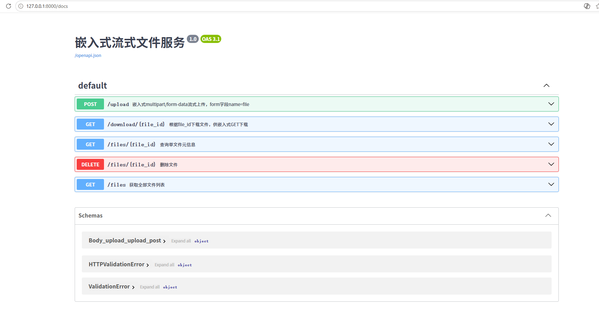
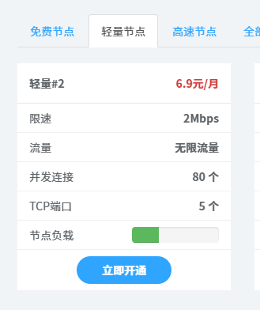
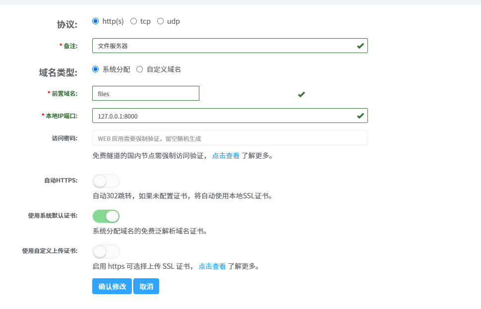
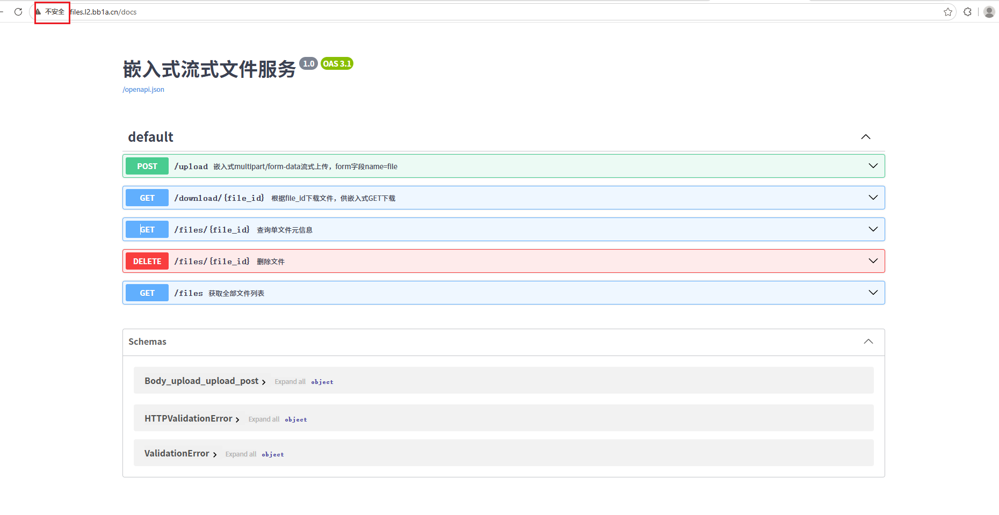
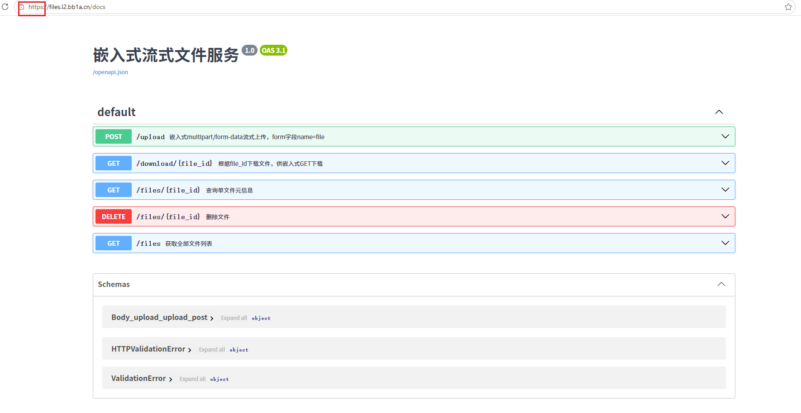
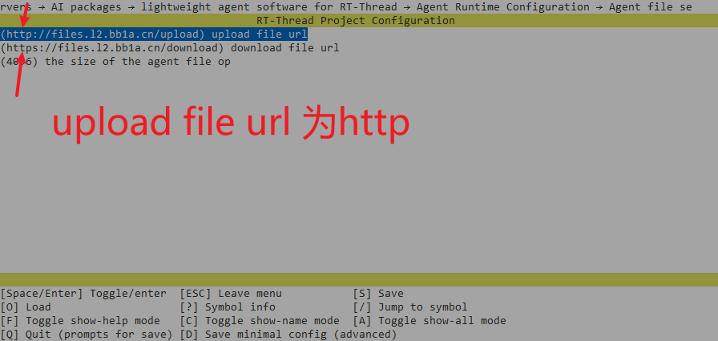
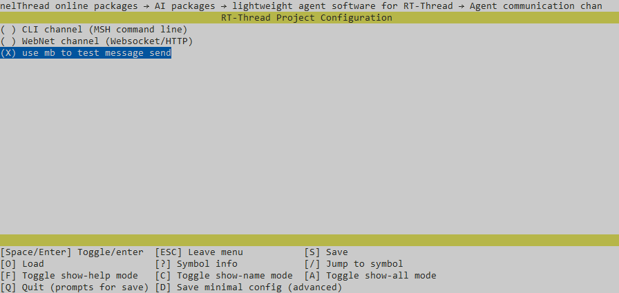
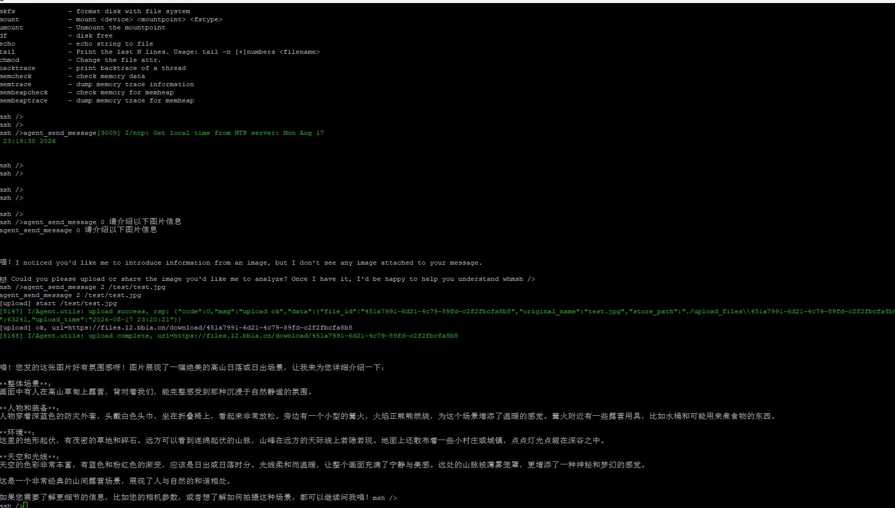

# 文件服务器搭建流程（仅多模态模式启用）

> 💡 说明：该文件服务器为 Agent 多模态图片上传的配套服务，**仅开启多模态功能时需要部署**，普通文本模式无需配置。

---

## 1. 环境准备：安装 uv

uv 是高性能 Python 包管理工具，用于统一锁定项目依赖版本，保证开发/运行环境一致性。

```bash
pip install uv
```

> 如果 pip 下载慢，可使用清华源安装：
> ```bash
> pip install uv -i https://pypi.tuna.tsinghua.edu.cn/simple
> ```

## 2. 部署文件服务器

**① 切换工作目录至文件服务器工程目录**

```bash
cd Agent-latest\resource\file_server
```

**② 使用 uv 同步全部依赖**

```bash
uv sync
```

> `uv sync` 作用：读取 `pyproject.toml` 与 `uv.lock`，完整还原项目锁定版本依赖，等效于 `pip install -r requirements.txt`，保证所有人环境完全一致。

> ⚡ 安装慢优化：在 `pyproject.toml` 文件末尾添加清华 PyPI 镜像源配置：
> ```toml
> [tool.uv]
> index-url = "https://pypi.tuna.tsinghua.edu.cn/simple"
> ```

## 3. 启动本地文件服务器

> 默认监听端口：**8000**

```bash
uv run main.py
```

启动成功后，本地可访问：`http://127.0.0.1:8000/docs`



### 下载 URL 的拼装规则（理解"生成的 URL"）

- 上传接口 `/upload` **只返回 `file_id`（36 位 UUID），不返回完整下载 URL**；
- 下载 URL 由客户端拼装：`{下载基址}/download/{file_id}`；
- 本地调试基址：`http://127.0.0.1:8000`；内网穿透后基址：`https://你的穿透域名`。

## 4. 内网穿透配置

> 📌 需求：嵌入式 QEMU/硬件板子无法直接访问本机回环地址，需要内网穿透将本机 8000 端口暴露公网，使设备可以完成图片上传，大模型接口能够下载图片资源。

本项目集成**飞鸽内网穿透** Windows 客户端，也可自行选择其它穿透工具。

### 4.1 获取客户端

- 官网下载：[飞鸽内网穿透](https://www.fgnwct.com/)
- 项目内置 GUI 启动器路径：`packages\Agent-latest\resource\飞鸽启动器-0.4.exe`

### 4.2 通道参数配置

1. **通道类型建议优先选择付费通道**，带宽、稳定性更好，避免大文件上传超时。



2. 通道关键配置项：

| 配置项 | 填写说明 |
|---|---|
| 备注 | 自定义备注，便于区分通道 |
| 前置域名 | 自定义访问域名前缀 |
| 本地地址端口 | **`127.0.0.1:8000`**（必须和文件服务器监听端口一致） |
| 证书选项 | 选择系统默认证书 |



### 4.3 穿透成功后的两组访问地址

> ✔ 穿透成功后会生成两组访问地址：

- `http://xxx.fgnwct.com`（HTTP 明文地址）



- `https://xxx.fgnwct.com`（HTTPS 加密地址）



### ⚠️ 重要坑点（极易引发图片上传 20040 错误）

> **RT-Thread menuconfig 中，Agent 上传服务器地址必须填写 HTTP 地址，不要填写 HTTPS！**
> 使用 HTTPS 上传服务时，rt-thread 会出现 bug。

进入 RT-Thread `menuconfig` → Agent 组件配置，填入飞鸽生成的 **HTTP 公网地址**。



## 5. 完整链路校验清单

部署完成后按顺序确认，规避多模态上传报错：

1. ✅ `uv run main.py` 文件服务器正常运行，本地浏览器可打开 `127.0.0.1:8000`
2. ✅ 飞鸽内网穿透通道正常在线，HTTP 链接浏览器可以正常访问
3. ✅ Kconfig/menuconfig 配置项填入 **HTTP** 公网地址，禁止直接使用 HTTPS
4. ✅ 板子网络正常，NTP 时间同步成功（mbedTLS HTTPS 请求依赖系统时间）
5. ✅ 设备上传返回的 `url` 链接，复制到浏览器无痕窗口可直接访问下载图片
6. ✅ 下载 URL 中的 `file_id` 与服务器数据库完全一致（36 位 UUID，勿截断）
7. ✅ `curl -I <下载URL>` 返回 `200` 且 `Content-Type: image/jpeg` 等图片类型


## 多模态 聊天demo
1. 启用的通道为 : `PKG_AGENT_DEBUG_CHANNEL`



2. 效果demo

> 上传照片如下


> AI reply


## 6. 常见问题排查

| 现象 | 排查方向 |
|---|---|
| **uv sync 安装依赖超时** | 确认 `pyproject.toml` 已配置国内镜像源 |
| **板子上传图片返回 20040** | ① 检查 menuconfig 是否误用 HTTPS 地址（须用 HTTP）；② 确认穿透服务正常、生成的 URL 公网可访问；③ 确认 `file_id` 完整（36 位 UUID，截断会导致 404，LLM 抓到 404 页即报 20040）；④ 下载响应 `Content-Type` 必须是 `image/*` |
| **设备无法连接文件服务器** | 确认飞鸽通道本地端口填写为 `127.0.0.1:8000`，文件服务器没有被防火墙拦截 |
| **上传成功，但大模型无法下载图片** | 必须使用公网可访问的 HTTPS 链接；内网地址、localhost 地址 OpenAI/SiliconFlow 接口无法访问；穿透域名证书需被公网信任（浏览器访问无证书告警） |
| **下载 URL 返回 404** | `file_id` 与数据库不一致（常为手抄截断），可用 `/files` 接口核对完整 file_id |
